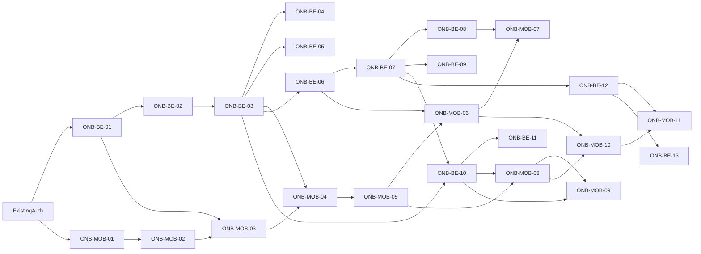

# Preppy Onboarding Issues

This backlog is the next execution slice for Preppy. User onboarding comes first because the current baseline already has Firebase auth, authenticated profile sync through `/v1/users/me`, and a simple dashboard integration, but it does not yet persist the learner profile, notebook setup, or onboarding-aware dashboard state needed for the study loop.

Detailed execution contracts live in `docs/superpowers/specs/2026-05-19-onboarding-execution-design.md`. This issue file is the scannable backlog index: issue order, dependencies, acceptance criteria, verification, and direct contract pointers.

## Baseline

| Area | Current status | Next implication |
| --- | --- | --- |
| Mobile | `apps/preppy_app` is the main Flutter app shell with auth and dashboard feature integration. | Gate newly authenticated users into onboarding before the dashboard. |
| Backend | `backend` is the Quarkus product API with Firebase auth, `/v1/users/me`, Postgres/Flyway, OpenAPI, and stubbed feature resources. | Extend the authenticated user model into onboarding, notebook, and dashboard contracts. |
| Roadmap | `ROADMAP.md` puts onboarding in MVP Epic M1 and student profile API in M0.1. | Start with profile persistence, then first notebook, then empty dashboard and upload readiness. |
| Architecture | `TECHNICAL.md` defines `StudentProfile`, `LearningCapabilityProfile`, `NotificationPreference`, and `Notebook` as target entities. | Keep onboarding data typed, persisted, user-scoped, and reusable by future plan generation. |

## Milestone Overview

| Milestone | Focus | Roadmap refs | Spec section | Exit criteria |
| --- | --- | --- | --- | --- |
| MS-01 | Onboarding and student profile | M0.1, M1.1 | `docs/superpowers/specs/2026-05-19-onboarding-execution-design.md#1-ms-01-onboarding-and-student-profile` | A signed-in mobile user completes onboarding, backend persists learner/profile/preferences data, and reload keeps the user onboarded. |
| MS-02 | First notebook setup | M0.2, M1.3 | `docs/superpowers/specs/2026-05-19-onboarding-execution-design.md#2-ms-02-first-notebook-setup` | An onboarded user creates a notebook for a subject, course, or exam and can read it back from the backend. |
| MS-03 | Onboarding-aware empty dashboard | M1.4, M7.1 | `docs/superpowers/specs/2026-05-19-onboarding-execution-design.md#3-ms-03-onboarding-aware-empty-dashboard` | Dashboard stops showing static assumptions for new users and displays correct empty states and next actions. |
| MS-04 | Upload and study-loop readiness | M0.3, M2.1 | `docs/superpowers/specs/2026-05-19-onboarding-execution-design.md#4-ms-04-upload-and-study-loop-readiness` | Notebook-scoped material upload entry points and backend contract requirements are ready for the ingestion milestone. |

## Shared Contracts

| Contract | Decision |
| --- | --- |
| Onboarding API | `PUT /v1/users/me/onboarding`; `GET /v1/users/me` returns onboarding status and profile. |
| Notebook API | `POST /v1/notebooks`, `GET /v1/notebooks`, `GET /v1/notebooks/{notebookId}`. |
| Material readiness API | `GET /v1/notebooks/{notebookId}/materials` returns notebook-scoped material metadata. |
| Dashboard API | `GET /dashboard/summary` returns `onboardingCompleted`, `notebookCount`, `nextAction`, zero-safe metrics, and optional plan summary. |
| Migration | `backend/src/main/resources/db/migration/V2__onboarding_notebooks.sql`. |
| Flutter route gate | `apps/preppy_app/lib/bootstrap/session_gate_provider.dart` coordinates auth, onboarding status, and active notebook count. |

## Dependency Graph

## MS-01: Onboarding And Student Profile

Goal: collect the learner context needed before notebook creation and future plan generation.

| Issue ID | Area | Title | Contract pointers | Depends on | Acceptance criteria | Verification | Priority |
| --- | --- | --- | --- | --- | --- | --- | --- |
| ONB-MOB-01 | Mobile | Add onboarding route gate after auth | Spec: route gate. API: `GET /v1/users/me`. Route: `/onboarding`. Files: `router.dart`, `session_gate_provider.dart`. | Existing auth flow | Fresh authenticated users land on onboarding; completed users land on dashboard or first-notebook based on notebook count; sign-out clears local route state. | Flutter router test or manual smoke: sign in with a new account, complete onboarding, restart app, confirm dashboard or first-notebook routing. | P0 |
| ONB-MOB-02 | Mobile | Build onboarding screen state and ViewModel | Spec: `OnboardingDraft`, `OnboardingScreenState`. Files: onboarding state, ViewModel, providers. | ONB-MOB-01 | UI watches one onboarding provider; save action uses callbacks; validation and API errors render through shared typed error handling. | `flutter test apps/packages/features/onboarding/test/application/onboarding_view_model_test.dart` covering initial, invalid, saving, success, and error states. | P0 |
| ONB-MOB-03 | Mobile | Implement learner profile form | DTO: `OnboardingUpsertRequest`. Fields: learning target, study level, goal type, target date, daily minutes, methods, notification opt-in, quiet hours. | ONB-MOB-02, ONB-BE-01 | Required fields block submission with inline messages; optional preferences can be skipped; submitted payload matches backend DTO. | `flutter test apps/packages/features/onboarding/test/presentation/onboarding_screen_test.dart` fills the form and asserts repository request. | P0 |
| ONB-MOB-04 | Mobile | Persist onboarding completion state | API: `PUT /v1/users/me/onboarding`. Gate refresh: `session_gateProvider` invalidation after save. | ONB-MOB-03, ONB-BE-03 | Successful save marks onboarding complete; failed save keeps user in flow with a typed error; reload uses backend state as source of truth. | Manual smoke: save onboarding, kill app, relaunch, confirm backend-driven route. | P0 |
| ONB-BE-01 | Backend | Add onboarding profile DTOs | DTOs: `OnboardingUpsertRequest`, `OnboardingProfileResponse`; enums: `StudyLevel`, `GoalType`, `LearningMethod`; extends `ProfileResponse`. | Existing `/v1/users/me` auth | DTOs include learning target, study level, goal type, target date, daily minutes, learning methods, notification opt-in, quiet hours, and onboarding status. | `cd backend && ./mvnw test -Dtest=OnboardingDtoTest` validates JSON serialization and bean validation. | P0 |
| ONB-BE-02 | Backend | Add profile persistence migration | Schema: `student_profiles`, `learning_capability_profiles`, `notification_preferences`, `users.onboarding_completed_at`. Migration: `V2__onboarding_notebooks.sql`. | ONB-BE-01 | Migration creates user-scoped rows with required constraints; clean DB migration succeeds. | `cd backend && ./mvnw test` or migration-focused integration test against Postgres service. | P0 |
| ONB-BE-03 | Backend | Implement authenticated onboarding upsert/read API | API: `PUT /v1/users/me/onboarding`; read through `GET /v1/users/me`. Files: `UserResource`, `UserService`, repository methods. | ONB-BE-02 | API derives user from Firebase identity, never from client user ID; upsert is idempotent; read returns persisted profile and completion flag. | `cd backend && ./mvnw test -Dtest=OnboardingResourceIT` creates a Firebase-authenticated profile update and reads it back. | P0 |
| ONB-BE-04 | Backend | Return typed onboarding validation errors | Error shape: `ErrorResponse`; invalid fields map to `errors[]`. Rules: past target date, invalid daily minutes, quiet-hour pair, enum failures. | ONB-BE-03 | Missing target date, invalid daily minutes, invalid quiet hours, and unsupported goal type return documented validation responses. | `cd backend && ./mvnw test -Dtest=OnboardingResourceIT#invalidOnboardingInputReturnsValidationErrors`. | P0 |
| ONB-BE-05 | Backend | Document onboarding API in OpenAPI | OpenAPI path: `PUT /v1/users/me/onboarding`; schemas for DTOs, enums, validation responses, bearer auth. | ONB-BE-03, ONB-BE-04 | OpenAPI includes onboarding endpoints, DTO fields, validation responses, and bearer auth. | `cd backend && ./mvnw test -Dtest=OpenApiContractTest` or inspect `/q/openapi` in dev mode. | P1 |

## MS-02: First Notebook Setup

Goal: let an onboarded user create the durable study workspace that later owns syllabus, material, plans, and practice.

| Issue ID | Area | Title | Contract pointers | Depends on | Acceptance criteria | Verification | Priority |
| --- | --- | --- | --- | --- | --- | --- | --- |
| ONB-MOB-05 | Mobile | Add first-notebook route after onboarding | API: `GET /v1/notebooks`. Route: `/onboarding/first-notebook`. Gate: active notebook count. | ONB-MOB-04, ONB-BE-03 | Onboarded users with zero active notebooks see first-notebook setup; users with active notebooks continue to dashboard. | Router test with two account fixtures: newly onboarded zero-notebook, existing active notebook. | P0 |
| ONB-MOB-06 | Mobile | Build notebook creation form | DTO: `NotebookCreateRequest`. Fields: name, goal type, `subjectLabel`, target date, board, semester, exam track. | ONB-MOB-05, ONB-BE-06 | Required fields validate locally; save button handles loading and disabled state; successful creation navigates to dashboard. | `flutter test apps/packages/features/notebook/test/presentation/first_notebook_screen_test.dart`. | P0 |
| ONB-MOB-07 | Mobile | Show notebook creation error states | Errors: duplicate name, invalid date, auth, network. State: `NotebookCreationScreenState`. | ONB-MOB-06, ONB-BE-08 | Duplicate name, invalid date, and network failure show user-safe messages; form data remains editable after failure. | Widget test injects each typed error and verifies copy plus retained values. | P1 |
| ONB-BE-06 | Backend | Add notebook persistence schema | Schema: `notebooks` table; unique active name index per user. Migration: `V2__onboarding_notebooks.sql`. | ONB-BE-03 | Notebook records are user-scoped; required fields are constrained; target date supports future planning. | Migration/repository test creates a user and notebook row, then reads it back. | P0 |
| ONB-BE-07 | Backend | Implement notebook create/list/detail APIs | API: `POST /v1/notebooks`, `GET /v1/notebooks`, `GET /v1/notebooks/{notebookId}`. Files: `NotebookResource`, service, repository. | ONB-BE-06 | Client cannot create for another user; list returns only current user's notebooks; detail returns 404 for another user's notebook. | `cd backend && ./mvnw test -Dtest=NotebookResourceIT`. | P0 |
| ONB-BE-08 | Backend | Add notebook validation rules | Rules: duplicate active name, past target date, blank name, blank label, unsupported goal type. | ONB-BE-07 | Invalid payloads fail without database writes; duplicate names are handled predictably per user with a field error. | `cd backend && ./mvnw test -Dtest=NotebookResourceIT#invalidNotebookRequestsReturnValidationErrors`. | P1 |
| ONB-BE-09 | Backend | Add notebook OpenAPI docs | OpenAPI paths and schemas for create/list/detail, validation responses, auth. | ONB-BE-07, ONB-BE-08 | Swagger shows create/list/detail endpoints, auth requirement, validation responses, and notebook fields. | Inspect `/q/openapi` or run `cd backend && ./mvnw test -Dtest=OpenApiContractTest`. | P1 |

## MS-03: Onboarding-Aware Empty Dashboard

Goal: make the dashboard reflect real onboarding and notebook state instead of static demo metrics.

| Issue ID | Area | Title | Contract pointers | Depends on | Acceptance criteria | Verification | Priority |
| --- | --- | --- | --- | --- | --- | --- | --- |
| ONB-MOB-08 | Mobile | Replace static new-user dashboard with empty state | DTO: `DashboardSummaryResponse`. Files: dashboard entity, mapper, screen. Next action: `create_notebook` or `complete_onboarding`. | ONB-MOB-05, ONB-BE-10 | Empty dashboard shows create notebook or continue notebook setup CTA; no fake coverage, due cards, streak, or PYQ metrics appear. | `flutter test apps/packages/features/dashboard/test/presentation/dashboard_screen_test.dart`. | P0 |
| ONB-MOB-09 | Mobile | Add dashboard CTA wiring | Routes: `/onboarding`, `/onboarding/first-notebook`, notebook material route, practice route. | ONB-MOB-08, ONB-BE-10 | CTA targets are deterministic from summary response; tapping each CTA opens the expected mobile route. | Widget test with dashboard summary fixtures for no profile, no notebook, has notebook/no material, and no action. | P1 |
| ONB-BE-10 | Backend | Extend dashboard summary with onboarding state | API: `GET /dashboard/summary`; fields: `onboardingCompleted`, `notebookCount`, `nextAction`, `metrics`, `planToday`. | ONB-BE-03, ONB-BE-07 | Summary reflects profile and notebook data from Postgres; new accounts get onboarding action; onboarded users without notebooks get notebook action. | `cd backend && ./mvnw test -Dtest=DashboardResourceIT`. | P0 |
| ONB-BE-11 | Backend | Remove static dashboard assumptions for empty accounts | Rule: empty accounts return zero metrics and `planToday: null`; remove hard-coded demo values. | ONB-BE-10 | Empty users receive zero or empty metric fields plus next-action metadata; existing stub values are not shown as real progress. | `cd backend && ./mvnw test -Dtest=DashboardResourceIT#emptyAccountHasZeroMetrics`. | P0 |

## MS-04: Upload And Study-Loop Readiness

Goal: prepare the handoff from onboarding/notebook setup into notebook-scoped material upload without building the full ingestion pipeline in this slice.

| Issue ID | Area | Title | Contract pointers | Depends on | Acceptance criteria | Verification | Priority |
| --- | --- | --- | --- | --- | --- | --- | --- |
| ONB-MOB-10 | Mobile | Add notebook material entry point | UI: notebook material entry card. Route carries notebook ID. Status: material setup pending until ingestion lands. | ONB-MOB-06, ONB-MOB-08 | Users with a notebook can see an upload/source-material CTA; unsupported flows are clearly marked if not yet active. | Manual smoke creates notebook and confirms material CTA appears. | P1 |
| ONB-MOB-11 | Mobile | Define upload-ready UI states | States: `noMaterial`, `uploadPending`, `uploadProcessing`, `uploadFailed`, `uploadReady`. Backend enum: `MaterialStatus`. | ONB-MOB-10, ONB-BE-12 | UI state names align with backend material/job status terms; no full ingestion behavior is implied before backend support exists. | `flutter test apps/packages/features/notebook/test/presentation/notebook_material_state_test.dart`. | P2 |
| ONB-BE-12 | Backend | Define notebook material metadata contract | Schema: `notebook_materials`; API: `GET /v1/notebooks/{notebookId}/materials`; DTO: `NotebookMaterialResponse`. | ONB-BE-07 | Contract includes notebook ID, material type, source role, filename, status, document ID, job ID, and user scoping rules. | `cd backend && ./mvnw test -Dtest=NotebookMaterialContractTest` plus contract review against M0.3. | P1 |
| ONB-BE-13 | Backend | Align ingestion stub with notebook scope | Requirement: future `POST /ingestion/upload` requires notebook ownership before creating document/material/job records. | ONB-BE-12 | Future upload cannot create loose `ingested_docs`; upload requires notebook scope and authenticated ownership checks. | API contract test rejects upload without notebook scope before ingestion implementation. | P2 |

## Later Scope

| Area | Deferred work | Reason |
| --- | --- | --- |
| Web | Web onboarding and web notebook setup | Roadmap requires web for MVP, but the current execution slice is mobile plus backend. |
| AI | LLM gateway, generated MCQs, flashcards, and provenance validation | Requires ingestion, chunking, and notebook material readiness first. |
| PYQ | PYQ upload, mapping, analytics, and mock exams | Depends on notebook, ingestion, topic mapping, and practice foundations. |
| Notifications | FCM-driven plan nudges and quiet-hour enforcement | Depends on persisted notification preferences, daily plan, and SRS due items. |

