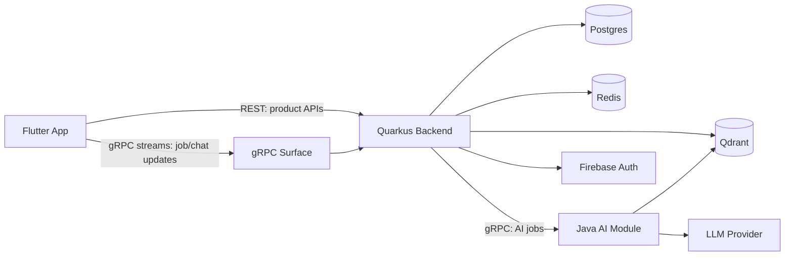
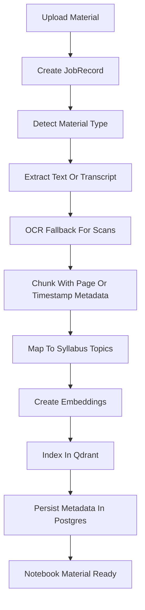

# Preppy Technical Architecture

## Executive Technical Summary

Preppy is a self-preparation platform for school, university, and competitive-exam students. The product turns a learner's own syllabi, textbooks, notes, PDFs, images, videos, PPTs, docs, spreadsheets, and previous-year questions into structured notebooks: ingestion, OCR/extraction, chunking, syllabus-to-source mapping, retrieval, question generation, flashcards, spaced repetition, PYQ/mock-exam workflows, and an adaptive study plan.

The current implementation is centered on a Quarkus 3 backend with Firebase authentication, REST APIs, Postgres/Flyway persistence, Redis configuration, Qdrant configuration, OpenAPI documentation, and early module boundaries for ingestion, taxonomy, questions, SRS, PYQ, users, and dashboard summary. The target architecture keeps Quarkus as the product/API core, expands the product model around student profiles, notebooks, topic workspaces, and study plans, and adds a separate Java AI module for LangChain/LangChain4j-style orchestration, RAG execution, generation, and chat streams.

The communication model is intentionally mixed:

- REST handles normal request/response product APIs such as onboarding/profile, notebooks, dashboard, taxonomy, PYQ browsing, SRS review, plan editing, and question retrieval.
- gRPC handles long-running or streaming workloads such as ingestion progress, generation progress, RAG chat, token streams, and job status updates.
- Postgres remains the transactional source of truth.
- Qdrant stores embeddings for user-owned study material and retrieval-ready knowledge chunks.
- Redis supports cache, short-lived coordination, idempotency, and near-real-time job state.

This document is a target architecture blueprint. Sections marked **Implemented** describe code that exists in this repository today. Sections marked **Stubbed** describe placeholders or early skeletons. Sections marked **Planned** describe the intended execution model.

## Architecture Principles

### User Material Is The Source Of Truth

Preppy is not a generic chatbot over PDFs. User-uploaded syllabi, textbooks, notes, handwritten material, media, and PYQs are the primary knowledge base. Every generated question, card, explanation, recommendation, and PYQ mapping should preserve provenance back to source documents, pages, chunks, timestamps where available, and syllabus topics.

### Notebooks Are The Product Boundary

A notebook is the durable study workspace for a subject, course, or exam. It owns the completion date, syllabus, bibliography/textbooks, uploaded materials, topic workspaces, baseline assessments, study plans, and practice history. Product APIs should scope learning workflows through notebooks instead of treating uploads as loose documents.

### Quarkus Owns Product State

The Quarkus backend is the product core. It owns authentication, user identity, REST APIs, OpenAPI contracts, product workflows, job records, transactional data, and feature modules. AI execution can be delegated, but product state should not drift into the AI module as a second source of truth.

### AI Is A Bounded Execution Module

The Java AI module is planned as a separate runtime that performs RAG retrieval, prompt orchestration, question generation, flashcard generation, and chat streaming. It should communicate through explicit contracts and return structured results with provenance metadata.

### REST By Default, gRPC For Streaming

REST remains the default for synchronous product APIs because it is easy to inspect, document, cache, and use from Flutter. gRPC is reserved for workloads where it adds clear value: server-streaming progress, token streams, bidirectional chat, and worker-style AI execution.

### Provenance Before Polish

Generated content must be auditable before it is beautiful. A lower-quality generated question with exact page references is more useful than a polished answer with unclear origin. The architecture should enforce provenance in data models, APIs, UI, and AI prompts.

### Plans Must Be Editable And Realistic

The planner should use timeframe, available minutes, baseline knowledge, review backlog, material volume, and learning capability to create a first plan, but the student must be able to modify it. Preppy should optimize for steady daily progress and recovery from missed days instead of brittle schedules that assume perfect behavior.

### Build Narrow, Keep Extraction Points Clear

The first production path should be narrow: one or two notebook flows with PDFs/images, syllabus mapping, topic practice, and plan nudges before every file type and advanced exam format is supported. The codebase can start as a practical modular system, but the boundaries for AI/RAG extraction, job orchestration, multimodal processing, and streaming contracts should be explicit from the beginning.

## Current Implementation Status

| Area | Status | Current implementation | Target direction |
| --- | --- | --- | --- |
| Flutter app shell | Implemented | `apps/preppy_app` exists as the application shell. | Consume REST APIs for product flows and gRPC streams for long-running status/chat. |
| Quarkus backend | Implemented | `backend` is a Quarkus 3.x Java 17 application. | Remain the product/API core. |
| Firebase authentication | Implemented | `FirebaseAuthenticationMechanism`, `FirebaseAuthService`, and `/v1/users/me` profile sync exist. | Continue using Firebase ID tokens at the edge of product APIs. |
| REST API resources | Stubbed | User APIs are functional; ingestion, taxonomy, question, SRS, PYQ, and dashboard resources exist with early/static behavior. | Expand each resource into production feature APIs with typed request/response contracts, plus planned onboarding, notebook, and plan APIs. |
| Student onboarding | Planned | Authenticated profile sync exists, but learner profiling and onboarding questions are not implemented. | Add student profile, learning preferences, target dates, and notification preferences. |
| Notebook workspace | Planned | No durable notebook aggregate exists yet. | Add notebooks as subject/exam workspaces that own syllabus, materials, topic workspaces, plans, and practice history. |
| OpenAPI/Swagger | Implemented | SmallRye OpenAPI and Swagger UI are configured. | Treat OpenAPI as the REST contract source for clients and QA. |
| Postgres and Flyway | Implemented | Datasource and Flyway migrations are configured. | Store users, profiles, notebooks, materials, documents, chunks, syllabus, questions, cards, reviews, PYQs, plans, and job records. |
| Redis | Configured | Redis is present in local infra and Quarkus config. | Use for cache, short-lived coordination, rate limits, and job/event fan-out. |
| Qdrant | Configured | Qdrant is present in local infra and the Java client dependency is configured. | Store notebook-scoped vector embeddings for document chunks, PYQs, generated content, and retrieval contexts. |
| PDF text extraction | Stubbed | PDFBox dependency and ingestion module exist. | Add upload storage, OCR fallback, page extraction, chunking, and provenance indexing. |
| gRPC surface | Stubbed | A small proto exists with `Ping` and `WatchJobStatus`. | Expand into job, ingestion, AI generation, and chat streaming contracts. |
| Java AI module | Planned | No separate AI runtime exists yet. | Add a separate Java module/service for LangChain/LangChain4j-style RAG, generation, and chat streams. |
| Question generation | Stubbed | `QuestionResource`, `QuestionService`, `FlashcardService`, `LlmGateway`, and `StubLlmGateway` exist. | Replace stubs with structured AI generation using RAG and provenance. |
| SRS and daily plans | Stubbed | `SrsResource`, `SrsService`, `SchedulerService`, and `DailyPlanService` exist. | Implement review scheduling, new-card selection, and daily playlist generation. |
| PYQ analytics | Stubbed | `PyqResource`, `PyqService`, and `PyqAnalyticsService` exist. | Ingest PYQs, tag topics, compute frequency and coverage, and support mock-exam sessions. |
| Observability | Partially implemented | Prometheus Micrometer dependency and request/API log helpers exist. | Add structured job logs, AI trace metadata, latency metrics, and generation quality dashboards. |

## Target System Architecture



The Flutter app authenticates with Firebase and calls the Quarkus backend with Firebase ID tokens. Quarkus verifies tokens, syncs user profiles, applies route authorization, and exposes REST endpoints for product screens. For long-running workloads, the app starts work through REST or gRPC and observes job updates through gRPC server streams.

Quarkus persists product state in Postgres and stores short-lived state in Redis. Qdrant is the retrieval index for embeddings. The Java AI module receives explicit jobs from Quarkus, performs AI orchestration and retrieval, and returns structured outputs that Quarkus validates and persists.

## Runtime Components And Responsibilities

### Flutter App

Status: **Implemented shell, planned feature depth**

Responsibilities:

- Authenticate users through Firebase.
- Render onboarding, notebooks, topic workspaces, dashboard, syllabus coverage, decks, MCQs, PYQ practice, and daily plan surfaces.
- Call REST APIs for normal product queries and mutations.
- Subscribe to gRPC streams for job progress, generation progress, and chat responses.
- Keep UI state separate from raw async data using feature-level state models.

### Quarkus Backend

Status: **Implemented core, stubbed feature modules**

Responsibilities:

- Verify Firebase ID tokens.
- Sync authenticated user profiles.
- Expose REST APIs and OpenAPI documentation.
- Own student profiles, notebooks, product workflow state, and transactional records.
- Coordinate ingestion, generation, SRS, PYQ, taxonomy, and dashboard workflows.
- Persist source-of-truth data in Postgres.
- Write and read vector retrieval metadata with Qdrant.
- Coordinate long-running jobs and stream status through gRPC.
- Delegate AI-specific execution to the Java AI module.

Current resource boundaries:

- `UserResource`: authenticated profile and FCM-token APIs.
- `IngestionResource`: upload entry point for PDFs/images.
- `TaxonomyResource`: syllabus tree and coverage summary APIs.
- `QuestionResource`: question generation and flashcard retrieval entry points.
- `SrsResource`: review recording and daily plan entry points.
- `PyqResource`: PYQ browsing and analytics entry points.
- `DashboardResource`: authenticated dashboard summary entry point.

Planned resource boundaries:

- `OnboardingResource`: learner profile, study level, goals, preferences, target dates, and notification settings.
- `NotebookResource`: notebook creation, material library, completion date, plan state, and workspace summary.
- `PlanResource`: generated study plans, student edits, task completion, replanning, and recovery from missed work.

### Java AI Module

Status: **Planned**

Responsibilities:

- Implement LangChain/LangChain4j-style chains for retrieval, generation, evaluation, and chat.
- Convert product jobs into prompt plans and model calls.
- Retrieve relevant chunks from Qdrant.
- Generate structured diagnostics, MCQs, flashcards, short-answer prompts, explanations, and chat responses.
- Stream token-level or event-level progress back to Quarkus.
- Return outputs with source references, confidence metadata, and validation status.

The AI module should not own student profiles, notebooks, billing, product settings, syllabus state, plans, or review state. It can cache execution details, but durable product records belong in Postgres through Quarkus.

### Postgres

Status: **Implemented infrastructure**

Responsibilities:

- Transactional source of truth for users and product entities.
- Durable storage for document metadata, chunks, syllabus items, coverage, questions, cards, reviews, PYQs, daily plans, and job records.
- Auditable provenance records linking generated content to source documents and pages.
- Migration management through Flyway.

### Qdrant

Status: **Configured, planned usage**

Responsibilities:

- Store embeddings for document chunks, PYQ chunks, syllabus descriptions, generated cards, and retrieval contexts.
- Support filtered vector search by `userId`, `exam`, `paper`, `topicPath`, `documentId`, `pageRange`, `chunkType`, and content status.
- Provide retrieval candidates to the Java AI module for RAG.

### Redis

Status: **Configured, planned usage**

Responsibilities:

- Cache frequently requested product summaries.
- Store short-lived job status snapshots.
- Support stream fan-out for job and chat progress.
- Handle idempotency keys for upload/generation requests.
- Support rate limiting and temporary locks for expensive AI work.

### Firebase

Status: **Implemented**

Responsibilities:

- Authenticate users on the client.
- Issue Firebase ID tokens.
- Provide verified identity claims to Quarkus through the Firebase Admin SDK.

## Communication Model: REST vs gRPC

### REST Product APIs

Status: **Implemented foundation, stubbed feature depth**

REST is the default API style for product screens and synchronous actions. These APIs are easy to inspect in Swagger UI, easy to test through conventional HTTP tooling, and suitable for most Flutter data fetching.

Current and target REST areas:

- `GET /v1/users/me`: sync and return the authenticated profile.
- `PUT /v1/users/me/onboarding`: upsert the authenticated user's student profile, learning capability profile, notification preferences, and onboarding completion timestamp.
- `PUT /v1/users/me/fcm-token`: update push-notification token.
- `POST /v1/notebooks`: create a notebook for the authenticated user.
- `GET /v1/notebooks`: list the authenticated user's notebooks.
- `GET /v1/notebooks/{notebookId}`: read an authenticated user's notebook by ID.
- `GET /v1/notebooks/{notebookId}/materials`: list notebook-scoped material metadata for upload readiness.
- `POST /ingestion/upload`: start an upload/ingestion workflow.
- `GET /taxonomy/syllabus`: fetch exam syllabus tree.
- `GET /taxonomy/coverage`: fetch per-user coverage summary.
- `POST /questions/generate`: request question generation.
- `GET /questions/flashcards`: fetch due flashcards.
- `POST /srs/review`: record card/question review.
- `GET /srs/plan/today`: fetch today's daily plan.
- `GET /pyq`: browse PYQs.
- `GET /pyq/analytics`: fetch topic-frequency analytics.
- `GET /dashboard/summary`: fetch dashboard summary.

REST should continue to return typed JSON envelopes, validation errors, and auth errors using the backend's common response and exception-mapping layer.

### gRPC Streaming APIs

Status: **Stubbed proto, planned production contracts**

gRPC should be used where a normal REST request would either block too long or lose useful progress information. The current proto defines an app-agnostic `RpcSurface` with `Ping` and `WatchJobStatus`. The target surface should expand around long-running work and streaming AI responses.

Proposed future methods:

```proto
service JobService {
  rpc WatchJobStatus(WatchJobStatusRequest) returns (stream JobStatusEvent);
}

service IngestionService {
  rpc StartIngestionJob(StartIngestionJobRequest) returns (StartIngestionJobResponse);
  rpc WatchIngestionJob(WatchIngestionJobRequest) returns (stream IngestionJobEvent);
}

service AiGenerationService {
  rpc GenerateQuestionSet(GenerateQuestionSetRequest) returns (stream GenerationEvent);
  rpc GenerateFlashcards(GenerateFlashcardsRequest) returns (stream GenerationEvent);
}

service ChatService {
  rpc StartChatStream(ChatRequest) returns (stream ChatEvent);
}
```

These are proposed contracts, not implemented APIs. They should be finalized only when the first production streaming feature is implemented.

Recommended event phases:

- `queued`
- `validating`
- `extracting_text`
- `chunking`
- `embedding`
- `indexing`
- `retrieving_context`
- `generating`
- `validating_output`
- `persisting`
- `completed`
- `failed`

Each event should include a stable `jobId`, phase, human-readable detail, progress percentage where meaningful, timestamp, and structured error details for failures.

## Authentication And Authorization

Status: **Implemented foundation**

The backend verifies Firebase ID tokens through the Firebase Admin SDK. Clients send an `Authorization: Bearer <id-token>` header to protected routes. `FirebaseAuthenticationMechanism` validates the token, builds a `UserPrincipal`, assigns the `user` role, and stores the verified Firebase token in the Quarkus security identity.

Route protection is configured centrally in `application.properties`:

- Public routes: `/q/*`, `/health`, `/metrics`
- Authenticated routes: `/*`

`GET /v1/users/me` provisions or syncs the product profile from Firebase identity claims. This route is the anchor for profile data such as email, display name, auth origin, and push-notification token.

Target authorization model:

- Every product record should be scoped by internal `userId`.
- User-owned documents, chunks, questions, cards, PYQs, and plans must be filtered by authenticated user.
- Admin/backoffice APIs, if added, should use explicit roles and never rely on hidden route conventions.
- AI jobs should carry user and document scope from Quarkus to the AI module, not trust client-provided identifiers directly.

## Data Architecture

Status: **Implemented foundation, planned schema depth**

Postgres is the durable source of truth. Qdrant is the vector index. Redis is short-lived coordination/cache infrastructure. Generated content should never exist only in Qdrant or Redis; durable content and provenance must be persisted in Postgres.

Core target entities:

- `User`: internal product user mapped to Firebase identity.
- `StudentProfile`: learner identity, age or study level, learning goals, preferred methods, language preferences, and onboarding completion.
- `LearningCapabilityProfile`: baseline confidence, diagnostic performance, pace assumptions, daily/weekly availability, and plan difficulty preferences.
- `NotificationPreference`: review reminder windows, quiet hours, channel preferences, and opt-in state.
- `Notebook`: subject, course, or exam workspace with goal, completion date, owner, status, and summary metrics.
- `NotebookMaterial`: uploaded or linked study material scoped to a notebook, including syllabus files, bibliography/textbooks, notes, media, and PYQs.
- `ExamProfile`: optional exam-specific extension for competitive tracks, including exam type, target date, available study time, and selected papers.
- `Document`: uploaded source file metadata for PDFs, images, notes, PPTs, docs, spreadsheets, videos, and links as support expands.
- `Page`: page-level extraction metadata.
- `Chunk`: retrieval-ready text or transcript segment with page range, timestamp range where applicable, source type, and topic candidates.
- `EmbeddingRecord`: mapping between Postgres chunk identity and Qdrant point identity.
- `SyllabusItem`: hierarchical exam taxonomy node.
- `SyllabusCoverage`: per-user coverage status for syllabus nodes.
- `TopicWorkspace`: per-notebook workspace for a syllabus topic, linked materials, generated artifacts, review state, and confidence.
- `BaselineAssessment`: lightweight diagnostic questions and answers used to estimate starting knowledge before planning.
- `Question`: generated or imported question with type, options, answer, rationale, difficulty, and source references.
- `Flashcard`: atomic recall item derived from a chunk, question, or PYQ.
- `CardReview`: SRS review event with rating and next due time.
- `PYQQuestion`: previous-year question metadata, year, paper, topic, marks, and source.
- `PYQMockExam`: timed or untimed mock session assembled from uploaded or curated PYQs.
- `StudyPlan`: editable plan generated from notebook scope, target date, available time, baseline capability, topic priority, and backlog.
- `PlanTask`: date-bound learning, review, practice, mock, or catch-up task with estimated minutes and completion state.
- `DailyPlan`: date-bound view of plan tasks, review, practice, and generation tasks.
- `JobRecord`: durable state for ingestion, generation, indexing, and chat-related background work.

### Provenance Model

Every generated learning artifact should store references back to source material:

- `documentId`
- `notebookId`
- `pageStart`
- `pageEnd`
- `timestampStart`
- `timestampEnd`
- `chunkIds`
- `topicPath`
- `syllabusItemIds`
- `generationJobId`
- `modelProvider`
- `promptTemplateVersion`

This allows the UI to show “why this exists,” lets users jump back to source context, maps PYQs to exact source material, and gives the team an audit trail for debugging hallucinations.

## RAG Architecture With Qdrant

Status: **Configured infrastructure, planned execution**

Qdrant will store vector embeddings for source chunks and retrieval-oriented content. It should be treated as an index, not the system of record. Each Qdrant point should map back to a durable Postgres record.

Recommended Qdrant collection strategy:

- Start with one collection for study chunks, partitioned through payload filters.
- Use payload fields such as `userId`, `notebookId`, `exam`, `paper`, `subject`, `topicPath`, `syllabusItemIds`, `documentId`, `pageStart`, `pageEnd`, `timestampStart`, `timestampEnd`, `sourceType`, and `contentLanguage`.
- Add separate collections later only if retrieval behavior, embedding models, or retention policies differ materially.

Target retrieval flow:

1. Quarkus receives a generation or chat request.
2. Quarkus validates user and notebook access, creates a `JobRecord`, and sends a scoped request to the Java AI module.
3. The AI module embeds the query or generation objective.
4. The AI module searches Qdrant with user/notebook/topic filters.
5. The AI module reranks and trims retrieved chunks.
6. The AI module builds a prompt with retrieved context and provenance metadata.
7. The LLM returns structured output.
8. The AI module validates shape and source coverage.
9. Quarkus persists accepted output in Postgres.
10. Flutter receives progress and completion events through gRPC or final data through REST.

The retrieval layer must avoid cross-user and cross-notebook leakage by requiring `userId` plus `notebookId` or an approved shared-curated-content scope in every query.

## Java AI Module And Chat Streaming

Status: **Planned**

The AI module is a separate Java runtime dedicated to model orchestration. It can use LangChain4j or a similar Java-native LangChain-style framework. It should be deployed separately once AI execution becomes heavy enough to require independent scaling, dependency management, and observability.

Primary capabilities:

- RAG retrieval over Qdrant.
- Prompt orchestration for MCQs, flashcards, PYQs, short-answer prompts, and explanations.
- Chat over user material with source-grounded answers.
- Streaming response events for chat and generation progress.
- Output validation before results are persisted.

The AI module should receive requests from Quarkus that are already authenticated and scoped. It should not accept public client traffic directly in v1.

Suggested AI job request shape:

```json
{
  "jobId": "job_123",
  "userId": "user_123",
  "notebookId": "notebook_123",
  "exam": "UPSC_CSE",
  "paper": "GS_PRELIMS",
  "topicPath": ["History", "Modern India"],
  "task": "GENERATE_MCQ_SET",
  "constraints": {
    "questionCount": 10,
    "difficulty": "MIXED",
    "sourceDocumentIds": ["doc_123"]
  }
}
```

Suggested AI output shape:

```json
{
  "jobId": "job_123",
  "items": [
    {
      "type": "MCQ_SINGLE_CORRECT",
      "question": "Which of the following statements is correct?",
      "options": ["A", "B", "C", "D"],
      "answer": "A",
      "explanation": "Grounded explanation from retrieved context.",
      "difficulty": "MEDIUM",
      "sourceReferences": [
        {
          "documentId": "doc_123",
          "pageStart": 12,
          "pageEnd": 13,
          "chunkId": "chunk_456"
        }
      ]
    }
  ]
}
```

## Ingestion And Generation Pipeline

Status: **Stubbed entry points, planned production flow**

Target ingestion flow:



The initial implementation can process small uploads synchronously during development, but the production design should treat ingestion as a long-running job. Large PDFs, scanned material, OCR, embedding, video transcription, and future PPT/doc/spreadsheet extraction can all exceed a normal HTTP request budget.

Target material support:

- v1 starts with PDFs and images, including scanned or handwritten notes where OCR quality is sufficient.
- Later versions add video/audio transcript extraction, PPT/document parsing, spreadsheets, web links, and richer media metadata.
- Every material type should normalize into notebook-scoped metadata plus retrieval chunks, even if extraction quality varies by type.

Target generation flow:

1. User selects a notebook, topic workspace, document, syllabus area, or plan task.
2. Quarkus validates access and creates a generation job.
3. Java AI module retrieves source chunks from Qdrant.
4. AI module generates structured diagnostics, questions, cards, or explanations.
5. AI module streams progress and partial validation events.
6. Quarkus persists accepted artifacts and rejects invalid artifacts.
7. Flutter shows the generated set, linked source pages, and next practice action.

Output validation rules:

- Every generated item must include at least one source reference.
- Every source reference must belong to the requesting user or an approved curated corpus.
- MCQs must have valid option counts and exactly one correct answer for single-correct types.
- Flashcards should be atomic and answerable without requiring unrelated context.
- Explanations should cite source chunks rather than invent unsupported claims.

## Notebook, Taxonomy, SRS, PYQ, And Dashboard Workflows

### Student Onboarding And Profile

Status: **Planned**

Onboarding should create a `StudentProfile`, `LearningCapabilityProfile`, and `NotificationPreference` before the first meaningful plan is generated. The concrete execution contract for the first onboarding slice is `docs/superpowers/specs/2026-05-19-onboarding-execution-design.md`; it fixes the REST paths, DTO fields, enum values, route gates, and Postgres tables used by MS-01 through MS-04.

The target questionnaire should capture:

- What the student is learning.
- Study level or age group.
- Goal type, such as school subject, university course, competitive exam, or professional self-study.
- Target date or completion date.
- Available study time and weekly rhythm.
- Known learning preferences, such as visual explanations, active recall, MCQs, flashcards, videos, or reading.
- Notification and focus preferences.

The profile should remain editable. Plan generation should treat onboarding values as constraints and starting assumptions, then refine them with baseline assessments and observed completion behavior.

### Notebook And Topic Workspace

Status: **Planned**

A notebook is the durable aggregate for a subject, course, or exam. It should contain:

- Notebook goal and target completion date.
- Uploaded syllabus and bibliography/textbooks.
- Notes, handwritten material, images, PDFs, videos, PPTs, docs, spreadsheets, links, and PYQs as supported material types.
- Topic workspaces derived from syllabus items.
- Baseline assessments, generated artifacts, study plans, review history, and dashboard summary state.

Each topic workspace should act as a focused learning surface. It links the syllabus item to source pages/chunks, Q&A context, MCQs, flashcards, video or media references, review state, and weak-area signals.

### Exam Taxonomy

Status: **Stubbed**

The taxonomy module exposes syllabus trees and coverage summaries. For school and university notebooks, the hierarchy can be:

```text
notebook -> unit/module -> topic -> subtopic -> syllabus bullet
```

For competitive-exam notebooks, the hierarchy can remain:

```text
exam -> paper -> subject -> topic -> subtopic -> syllabus bullet
```

The first production taxonomy should stay narrow enough to validate the full notebook loop. Additional exam-specific taxonomies should be added only after onboarding, ingestion, mapping, practice, and planning work end to end.

### Syllabus Coverage

Status: **Stubbed**

Coverage should be computed from mapped chunks, generated artifacts, user reviews, and PYQ linkage. A syllabus item can start with simple status values:

- `not_started`
- `partial`
- `covered`
- `needs_revision`

Later versions can add confidence scores based on source quality, recency, review performance, baseline results, and PYQ frequency.

### Baseline Validation

Status: **Planned**

After a notebook has enough mapped material, Preppy should generate lightweight diagnostic questions to estimate current knowledge. The baseline can include MCQs, flashcards, short answers, or self-confidence checks. Results should feed into the first study plan, but should not block the student from editing or starting the plan.

### Question And Flashcard Engine

Status: **Stubbed**

The question engine should generate notebook-scoped learning artifacts:

- School, university, and competitive-exam single-correct MCQs.
- Assertion-reason questions.
- Match-the-following questions.
- True/false statement sets.
- Short-answer prompts for Mains/NET.
- Atomic flashcards for active recall.

Every artifact must be linked to source pages and topic paths.

### SRS And Daily Planner

Status: **Stubbed**

SRS should begin with a simple review algorithm and evolve after real user behavior is observed. The planner should combine:

- Due review cards.
- New cards from under-covered high-priority topics.
- A small set of MCQs or PYQs.
- Baseline weak areas.
- Time left until the notebook completion date.
- Optional writing practice for Mains-oriented exams.

The plan should be constrained by target date, available minutes, learning capability, weak topics, material volume, and backlog size. Students must be able to edit the plan; the backend should record changes and regenerate future tasks when the student misses work or completes tasks early.

### PYQ Engine

Status: **Stubbed**

The PYQ engine should ingest user-provided PYQs or past papers first, then optionally add curated datasets where licensing permits. It should tag each question by year, paper or course, subject, topic, difficulty, question type, source document, and linked syllabus item.

Target outputs:

- Topic-wise PYQ coverage.
- Frequency trends across years.
- Topic-priority hints for study planning.
- Linked practice sessions from the daily plan.
- Mock-exam sessions from uploaded PYQs or filtered question sets.
- Source links from PYQ to syllabus topic and book/page/chunk where available.

### Dashboard

Status: **Stubbed static summary**

The dashboard should act as a control panel, not a content portal. It should answer:

- What should I do today?
- Which topics are weak or under-covered?
- How many cards are due?
- How much of the syllabus is mapped?
- Which PYQ areas are important?
- Am I on track for my notebook completion date or exam date?

## API Contract Strategy

Status: **Implemented REST docs, planned gRPC docs**

REST contracts should be documented through OpenAPI and available through Swagger UI in development. All new REST endpoints should use typed request and response DTOs, validation annotations, and common error responses.

gRPC contracts should live in proto files under the shared network package so Flutter and backend code generation can share the same definitions. Proto changes should be versioned by package path, such as `common.v1`, and should preserve backward compatibility once clients depend on them.

Recommended contract rules:

- Use REST for resource-oriented CRUD and synchronous queries.
- Use gRPC server streaming for progress and chat.
- Keep job identifiers stable across REST and gRPC.
- Scope notebook APIs by authenticated user and notebook ownership.
- Keep plan edits explicit so generated plans and student modifications are auditable.
- Return structured errors, not free-form strings.
- Do not expose internal database IDs unless they are intended client identifiers.
- Version breaking API changes explicitly.

## Local Development And Environments

Status: **Implemented foundation**

Local infrastructure is defined in `infra/docker-compose.yml`:

- Postgres 16
- Qdrant
- Redis 7

Local backend development uses:

```bash
cd infra
cp .env.example .env
docker compose up -d

cd ../backend
./mvnw quarkus:dev
```

The backend serves:

- REST API on `http://localhost:8080`
- Swagger UI on `http://localhost:8080/q/swagger-ui`
- Dev UI on `http://localhost:8080/q/dev/`
- OpenAPI document on `http://localhost:8080/q/openapi`

Firebase local development requires a service-account JSON path or classpath resource as described in `backend/README.md`. Protected routes require Firebase ID tokens, not Google OAuth access tokens.

Target environment split:

- `dev`: local Docker infra, Quarkus dev mode, development Firebase project.
- `staging`: production-like services, test Firebase project, seeded syllabus/PYQ data.
- `prod`: managed Postgres, managed Redis, persistent Qdrant, production Firebase project, production LLM credentials.

## Observability, Logging, And Reliability

Status: **Partially implemented, planned depth**

Current foundations include Micrometer Prometheus support, request logging helpers, and API log utilities. The target system needs additional visibility for long-running and AI-heavy workflows.

Required telemetry:

- HTTP request count, latency, and error rate.
- gRPC stream count, duration, cancellation rate, and error rate.
- Job lifecycle metrics by phase and outcome.
- OCR, chunking, embedding, indexing, and generation latency.
- Qdrant search latency and result counts.
- LLM provider latency, token usage, error rate, and timeout rate.
- Generated artifact acceptance/rejection counts.
- Per-user rate-limit and quota signals.

Reliability patterns:

- Use durable `JobRecord` rows for long-running work.
- Make upload and generation requests idempotent.
- Persist enough job state to recover after backend restart.
- Apply timeouts around LLM and Qdrant calls.
- Validate AI output before persisting.
- Prefer retries for transient infrastructure failures, not for validation failures.
- Capture failed job details without storing sensitive document text in logs.

## Security And Privacy

Status: **Implemented auth foundation, planned privacy depth**

Preppy handles user-uploaded study material, which may include textbooks, copyrighted coaching PDFs, teacher notes, personal notes, handwritten scans, class media, and exam prep annotations. Security and privacy should be treated as product requirements.

Security rules:

- Verify Firebase ID tokens on every protected backend request.
- Scope all user data by internal user identity.
- Never let the client choose another user's notebook, document, job, or Qdrant filter scope.
- Do not log raw PDF text, full prompts, full LLM outputs, or service-account credentials.
- Store production secrets outside git and outside application resources.
- Keep Firebase service account files gitignored.
- Use separate Firebase projects and LLM credentials per environment.

Privacy rules:

- Preserve source provenance for user trust.
- Make notebook or document deletion remove or tombstone related chunks, embeddings, generated artifacts, plans, reviews, and PYQ mappings according to retention policy.
- Separate user-owned corpora from curated/shared corpora.
- Avoid training or fine-tuning external models on user content unless explicitly supported by product policy and user consent.

## Delivery Roadmap

### Achieved Now

- Quarkus backend skeleton with module boundaries.
- Firebase ID-token verification and authenticated profile sync.
- Postgres/Flyway setup.
- Local Docker infra for Postgres, Qdrant, and Redis.
- OpenAPI/Swagger UI.
- REST resource skeletons for ingestion, taxonomy, questions, SRS, PYQ, and dashboard.
- Early proto surface for ping and job-status streaming.

### Phase 1: Backend Foundations

- Replace static/stub responses with typed DTOs and persisted entities.
- Implement onboarding profile, notebook, material metadata, and storage strategy.
- Implement PDF text extraction and chunking with page references.
- Seed the first notebook syllabus/taxonomy path.
- Persist syllabus coverage, topic workspaces, questions, flashcards, reviews, PYQs, study plans, and daily plan records.

### Phase 2: RAG And AI Integration

- Implement Qdrant collection creation and point indexing.
- Add embedding generation for chunks.
- Create the separate Java AI module.
- Define Quarkus-to-AI gRPC contracts.
- Implement notebook-scoped RAG retrieval and structured diagnostic/question/card generation.
- Persist source-grounded generated artifacts.

### Phase 3: Streaming Experience

- Expand proto contracts for job, ingestion, generation, and chat streams.
- Implement job status streaming from backend to Flutter.
- Add chat-over-material with source-grounded streaming responses.
- Add progress UI for ingestion and generation.

### Phase 4: Practice Loop And Alpha Hardening

- Implement SRS review scheduling.
- Implement editable study plan and daily playlist generation.
- Implement PYQ ingestion, topic mapping, analytics, and mock-exam sessions.
- Add dashboard metrics for coverage, due cards, weak topics, PYQ exposure, and notebook readiness.
- Add production-grade observability, quotas, and failure handling.
- Run closed alpha with a narrow notebook scope.

## Open Decisions

These decisions should be made before production implementation, but they do not block this technical blueprint:

- Exact OCR provider for scanned PDFs.
- Order of support for videos, PPTs, docs, spreadsheets, and web links after PDFs/images.
- Long-term object storage provider for uploaded documents.
- Embedding model and vector dimensions.
- Whether Qdrant is self-hosted or managed in production.
- Whether gRPC terminates in Quarkus only or has a dedicated gateway later.
- Exact Java AI framework dependency and deployment shape.
- Retention policy for deleted documents, embeddings, prompts, and generated outputs.
- Quota model for expensive AI generation and chat streams.
- Planner policy for student-edited schedules, missed days, and notification quiet hours.

## Execution Summary

The planned architecture keeps Preppy practical for v1 while preserving clean extraction points. Quarkus owns product state and normal APIs. The Java AI module owns AI execution. REST stays the default product interface. gRPC is reserved for streams and long-running jobs. Postgres stores truth. Qdrant powers retrieval. Redis supports coordination. The product differentiator is not just AI generation, but notebook-aware provenance, syllabus-to-source mapping, adaptive planning, spaced repetition, PYQ mock practice, and a daily learning loop built from the student's own material.
