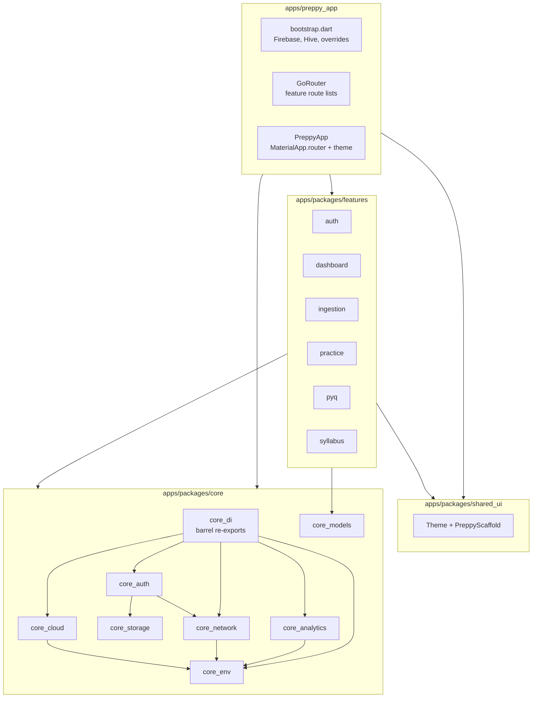

Preppy is a **Melos-managed Flutter workspace**: one shell app composes **feature packages**, which sit on top of **core** libraries and a shared **design system**. Configuration and secrets flow in at compile time via `--dart-define` / `--dart-define-from-file`.

## Repository layout

| Path | Role |
|------|------|
| `apps/preppy_app` | Flutter **shell**: bootstrap, `ProviderScope` overrides, `GoRouter`, `MaterialApp.router`, connectivity UX |
| `apps/packages/features/*` | **Feature modules** (screens + feature-local state); each exposes GoRouter route lists for the shell |
| `apps/packages/core/*` | **Shared infrastructure**: env, HTTP, storage, auth, analytics, cloud abstractions, DI barrel |
| `apps/packages/shared_ui` | **Design system**: theme, tokens, `PreppyScaffold` |

The root `pubspec.yaml` declares the workspace members (same paths as above). Melos scripts (`melos run run:dev`, `analyze`, etc.) are defined there.

## Dependency direction

- **`preppy_app`** depends on every feature package it mounts, on selected `core_*` packages, and on `shared_ui`.
- **Feature packages** depend on **`shared_ui`**, **`go_router`**, **`flutter_riverpod`**, and whichever **core** surface they need (for example `core_models`, `core_auth` for the auth feature). They must **not** depend on `preppy_app`.
- **`core_di`** is a **barrel** that re-exports providers from `core_analytics`, `core_auth`, `core_cloud`, `core_env`, and `core_network` (including connectivity types). Feature or shell code that wants a single import for cross-cutting providers can depend on `core_di`.
- **`core_models`** is pure Dart and sits at the bottom of the stack (no Flutter dependency in its `pubspec.yaml`).

## Shell responsibilities

1. **Bootstrap** (`lib/bootstrap/bootstrap.dart`): Ensures `BASE_URL` and related defines exist, initializes Firebase and Crashlytics, `SharedPreferences` + Hive, then runs `ProviderScope` with overrides for `appEnvProvider`, `cloudEnvProvider`, `baseUrlProvider`, and `authTokenProvider` (Firebase ID token).
2. **Routing** (`lib/bootstrap/router.dart`): Builds `GoRouter` from each feature’s exported `...Routes` list (`featureAuthRoutes`, `featureDashboardRoutes`, etc.). Adding a feature is an import plus one spread in the `routes` list.
3. **Presentation** (`lib/app.dart`): Applies `shared_ui`’s `themeProvider`, wires `routerConfig`, and listens to `connectivityStateProvider` (from `core_di` / `core_network`) for offline snackbars.

## State and dependency injection

- **Riverpod** is used app-wide (`flutter_riverpod` in the shell and features; `riverpod` in pure-Dart–friendly core packages).
- **Compile-time environment** is modeled by `AppEnv` / `CloudEnv` in `core_env` and **must** be overridden at bootstrap (`appEnvProvider`, `cloudEnvProvider`).
- **HTTP** uses a shared `Dio` from `dioProvider` with `AuthInterceptor` reading `authTokenProvider` (overridden in the shell to use Firebase).
- **Cloud** (`core_cloud` package): `firebaseDatabaseProvider`, `supabaseDatabaseProvider`, `neonDatabaseProvider`, and storage counterparts are **throwing placeholders** until the shell overrides them in `ProviderScope` when you wire a backend.

## Where `shared_ui` fits

`shared_ui` is the **visual layer** shared by the shell and features: `ThemeNotifier` / `themeProvider`, color and typography tokens, component themes (buttons, app bar, text fields), and `PreppyScaffold`. Features should use these instead of ad hoc `ThemeData` so the product stays visually consistent.

## Assumptions

- **Workspace tooling**: This doc reflects the `workspace:` list in the root `pubspec.yaml`. There is no separate `melos.yaml`; Melos configuration lives under `melos:` in that file.
- **Cloud overrides**: The codebase ships contracts and adapters; which database/storage providers you override in production is a deployment choice, not fixed in the shell snippet above.
