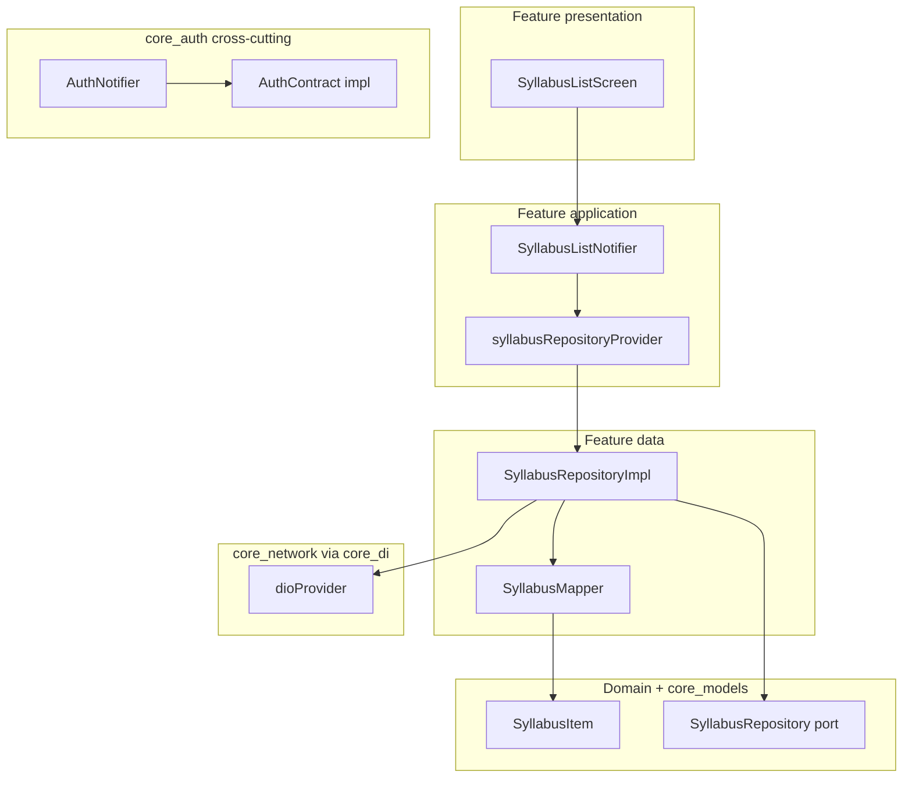

This guide explains **how to use models and packages** when building CRUD-style features in Preppy. Package pages document **what each library exports**; this page shows **how the pieces connect** in clean architecture.

**Hands-on tutorial:** [Example CRUD application](/guides/example-crud-application/) — step-by-step Syllabus feature using `core_models`, `core_network`, and Riverpod (with reference code in `apps/packages/features/syllabus/`).

Most feature packages today are **thin scaffolds** (screens + routes). The **recommended** layout for new CRUD work adds `domain/`, `data/`, and `application/` inside the feature. Cross-cutting concerns (auth, env, HTTP client) stay in **`core_*`** packages — see [`core_auth`](/packages/core-auth/) as the live example.

## Layer map

| Layer | Responsibility | Where in Preppy |
|-------|----------------|-----------------|
| **Entity** | Business object, no Flutter | [`core_models`](/packages/core-models/) for **shared** types; `lib/src/domain/entities/` for **feature-only** types |
| **Repository (port)** | Abstract CRUD API | Feature `lib/src/domain/repositories/` **or** `core_*/lib/src/contracts/` when reused app-wide |
| **Repository (impl)** | HTTP, cache, JSON mapping | Feature `lib/src/data/repositories/` using `dioProvider` / `storageProvider` |
| **Use case / Notifier** | Orchestration, progressive UI state | Feature `lib/src/application/` — Riverpod `AsyncNotifier` / `Notifier` |
| **Presentation** | Widgets, navigation | Feature `lib/src/presentation/` + `feature_*_routes.dart` |
| **DI** | Wiring providers | [`core_di`](/packages/core-di/) for cross-cutting; feature `*_providers.dart` for feature scope |



**Data flow for a list screen:** UI watches a provider → notifier calls repository → repository uses Dio → JSON is mapped to entities → notifier exposes `ApiResult` (or `AsyncValue`) → UI renders with `when` / `switch`.

## Feature package vs `core_*`

Use this decision tree before you add files.

### Put logic in a **`core_*` package** when

- More than one feature (or the shell) needs the same API.
- Bootstrap must wire it without importing a feature (e.g. `authTokenProvider`, `appEnvProvider`).
- The behavior is infrastructure, not a product vertical (auth, analytics, connectivity).

**Reference implementation:** `core_auth`

| Piece | Path |
|-------|------|
| Contracts (ports) | `apps/packages/core/auth/lib/src/contracts/` |
| Implementations | `apps/packages/core/auth/lib/src/impl/` |
| Models | `apps/packages/core/auth/lib/src/models/` |
| Providers | `apps/packages/core/auth/lib/src/providers/auth_providers.dart` |
| Orchestration | `apps/packages/core/auth/lib/src/auth_notifier.dart` (`authProvider`) |
| UI | `apps/packages/features/auth/lib/src/login_screen.dart` |

The login screen talks to **`authProvider`**, not to `AuthContract` directly.

### Put logic in a **feature package** when

- One vertical owns the CRUD (e.g. syllabus tree for the syllabus feature).
- Endpoints and UI evolve together.
- Types are not shared yet (keep entities in the feature until a second consumer appears).

**Recommended folder layout** (example: `apps/packages/features/syllabus/`):

```
lib/
  feature_syllabus.dart
  src/
    domain/
      repositories/syllabus_repository.dart
    data/
      repositories/syllabus_repository_impl.dart
      mappers/syllabus_mapper.dart
    application/
      syllabus_list_notifier.dart
      syllabus_providers.dart
    presentation/
      syllabus_list_screen.dart
      syllabus_detail_screen.dart
    feature_syllabus_routes.dart
```

## CRUD walkthrough: Syllabus items

:::tip[Prefer the step-by-step guide]
The full tutorial with correct API paths (`GET /taxonomy/syllabus`) and repo-aligned snippets is **[Example CRUD application](/guides/example-crud-application/)**. The sections below are a compact reference.
:::

This walkthrough uses `SyllabusItem` from `core_models` (`apps/packages/core/models/lib/entity/syllabus_item.dart`). The entity stays **pure** (no `fromJson` in `core_models`); parsing lives in the feature **data** layer.

### 1. Entity (shared model)

`SyllabusItem` already exists in `core_models`. For a feature-only type, add a class under `lib/src/domain/entities/` instead.

```dart
import 'package:core_models/core_models.dart';
// SyllabusItem: id, code, title, parentId, children
```

### 2. Mapper (data layer)

```dart
// lib/src/data/mappers/syllabus_mapper.dart
import 'package:core_models/core_models.dart';

mixin SyllabusMapper {
  SyllabusItem syllabusItemFromJson(Map<String, dynamic> json) {
    return SyllabusItem(
      id: json['id'] as String,
      code: json['code'] as String,
      title: json['title'] as String,
      parentId: json['parentId'] as String?,
      children: (json['children'] as List<dynamic>? ?? [])
          .map((e) => syllabusItemFromJson(e as Map<String, dynamic>))
          .toList(),
    );
  }

  Map<String, dynamic> syllabusItemToJson(SyllabusItem item) => {
    'id': item.id,
    'code': item.code,
    'title': item.title,
    if (item.parentId != null) 'parentId': item.parentId,
    'children': item.children.map(syllabusItemToJson).toList(),
  };
}
```

### 3. Repository port (domain)

```dart
// lib/src/domain/repositories/syllabus_repository.dart
import 'package:core_models/core_models.dart';

abstract interface class SyllabusRepository {
  Future<List<SyllabusItem>> fetchAll();
  Future<SyllabusItem> fetchById(String id);
  Future<SyllabusItem> create(SyllabusItem draft);
  Future<SyllabusItem> update(SyllabusItem item);
  Future<void> delete(String id);
}
```

Keep **terminal outcomes** as plain `Future<T>` or `Future` + exceptions inside the repository. Do not leak `BuildContext` or widgets into this layer.

### 4. Repository implementation (data)

```dart
// lib/src/data/repositories/syllabus_repository_impl.dart
import 'package:core_network/core_network.dart';
import 'package:dio/dio.dart';
import 'package:flutter_riverpod/flutter_riverpod.dart';

import '../../domain/repositories/syllabus_repository.dart';
import '../mappers/syllabus_mapper.dart';

class SyllabusRepositoryImpl with SyllabusMapper implements SyllabusRepository {
  SyllabusRepositoryImpl(this._dio);

  final Dio _dio;

  @override
  Future<List<SyllabusItem>> fetchAll() async {
    final response = await _dio.get<List<dynamic>>('/taxonomy/syllabus');
    final list = response.data ?? [];
    return list
        .map((e) => syllabusItemFromJson(e as Map<String, dynamic>))
        .toList();
  }

  @override
  Future<SyllabusItem> fetchById(String id) async {
    final response = await _dio.get<Map<String, dynamic>>('/taxonomy/syllabus/$id');
    return syllabusItemFromJson(response.data!);
  }

  @override
  Future<SyllabusItem> create(SyllabusItem draft) async {
    final response = await _dio.post<Map<String, dynamic>>(
      '/taxonomy/syllabus',
      data: syllabusItemToJson(draft),
    );
    return syllabusItemFromJson(response.data!);
  }

  @override
  Future<SyllabusItem> update(SyllabusItem item) async {
    final response = await _dio.put<Map<String, dynamic>>(
      '/taxonomy/syllabus/${item.id}',
      data: syllabusItemToJson(item),
    );
    return syllabusItemFromJson(response.data!);
  }

  @override
  Future<void> delete(String id) async {
    await _dio.delete('/taxonomy/syllabus/$id');
  }
}

final syllabusRepositoryProvider = Provider<SyllabusRepository>((ref) {
  return SyllabusRepositoryImpl(ref.watch(dioProvider));
});
```

Paths are relative to `baseUrlProvider` (set in shell bootstrap). See [`core_network`](/packages/core-network/).

### 5. Notifier + `ApiResult` (application)

[`ApiResult`](/packages/core-models/) models **idle → loading → success | error** for the UI. The hybrid pattern (documented in `api_result.dart`):

- Repository: `Future<List<SyllabusItem>>` (or catch and map errors).
- Notifier: emit `ApiResult.loading`, await repository, then `ApiResult.success` or `ApiResult.error`.

```dart
// lib/src/application/syllabus_list_notifier.dart
import 'package:core_models/core_models.dart';
import 'package:flutter_riverpod/flutter_riverpod.dart';

import '../data/repositories/syllabus_repository_impl.dart';

class SyllabusListNotifier extends Notifier<ApiResult<List<SyllabusItem>>> {
  @override
  ApiResult<List<SyllabusItem>> build() {
    _load();
    return const ApiResult.idle();
  }

  Future<void> _load() async {
    state = const ApiResult.loading();
    try {
      final repo = ref.read(syllabusRepositoryProvider);
      final items = await repo.fetchAll();
      state = ApiResult.success(items);
    } catch (e, st) {
      state = ApiResult.error(message: '$e', cause: st);
    }
  }

  Future<void> refresh() => _load();

  Future<void> remove(String id) async {
    final repo = ref.read(syllabusRepositoryProvider);
    await repo.delete(id);
    await _load();
  }
}

final syllabusListProvider =
    NotifierProvider<SyllabusListNotifier, ApiResult<List<SyllabusItem>>>(
  SyllabusListNotifier.new,
);
```

For a one-shot async screen you can use `AsyncNotifier` + `AsyncValue` instead (same style as `authProvider`).

### 6. Presentation (UI)

```dart
// lib/src/presentation/syllabus_list_screen.dart
import 'package:core_models/core_models.dart';
import 'package:flutter/material.dart';
import 'package:flutter_riverpod/flutter_riverpod.dart';
import 'package:shared_ui/shared_ui.dart';

import '../application/syllabus_list_notifier.dart';

class SyllabusListScreen extends ConsumerWidget {
  const SyllabusListScreen({super.key});

  @override
  Widget build(BuildContext context, WidgetRef ref) {
    final state = ref.watch(syllabusListProvider);

    return PreppyScaffold(
      appBar: AppBar(title: const Text('Syllabus')),
      body: state.when(
        idle: () => const SizedBox.shrink(),
        loading: (_) => const Center(child: CircularProgressIndicator()),
        success: (items) => ListView.builder(
          itemCount: items.length,
          itemBuilder: (_, i) => ListTile(
            title: Text(items[i].title),
            subtitle: Text(items[i].code),
          ),
        ),
        error: (msg, _, __) => Center(child: Text(msg)),
      ),
      floatingActionButton: FloatingActionButton(
        onPressed: () => ref.read(syllabusListProvider.notifier).refresh(),
        child: const Icon(Icons.refresh),
      ),
    );
  }
}
```

### 7. Routes and shell

Export routes from the feature barrel:

```dart
// lib/src/feature_syllabus_routes.dart
import 'package:go_router/go_router.dart';
import 'presentation/syllabus_list_screen.dart';

final featureSyllabusRoutes = <RouteBase>[
  GoRoute(
    path: '/syllabus',
    builder: (context, state) => const SyllabusListScreen(),
  ),
];
```

Register in the shell router (`apps/preppy_app/lib/bootstrap/router.dart`): import the feature and spread `...featureSyllabusRoutes` into the `routes` list (same pattern as `featureDashboardRoutes`).

### 8. `pubspec.yaml` dependencies

```yaml
dependencies:
  flutter:
    sdk: flutter
  core_models:
    path: ../../core/models
  core_network:   # or core_di if you only need the barrel
    path: ../../core/network
  shared_ui:
    path: ../../shared_ui
  flutter_riverpod: ^3.3.1
  go_router: ^14.6.1
```

Import **`core_network`** when you only need HTTP; import **`core_di`** when you also need auth, connectivity, or env in the same file.

## Checklists

### New shared entity

1. Add class under `apps/packages/core/models/lib/entity/`.
2. Export from `lib/core_models.dart`.
3. Add a unit test under `apps/packages/core/models/test/` if behavior is non-trivial.
4. Keep **no** `fromJson` in `core_models` unless the whole app agrees on one schema; prefer feature mappers until stable.

### New CRUD feature

1. Create or extend `apps/packages/features/<name>/`.
2. Add path dependencies: `core_models`, `core_network` or `core_di`, `shared_ui`, `flutter_riverpod`, `go_router`.
3. Implement `domain/` → `data/` → `application/` → `presentation/`.
4. Export `feature<Name>Routes` from `feature_<name>.dart`.
5. Add import + route spread in `preppy_app/lib/bootstrap/router.dart`.
6. Add the package to `preppy_app/pubspec.yaml` and root workspace `pubspec.yaml` if new.

### Anti-patterns

| Avoid | Prefer |
|-------|--------|
| `dio.get` inside `build()` | Notifier or repository called from `onPressed` / `initState` / notifier `build()` |
| JSON parsing in widgets | `SyllabusMapper` in data layer |
| Duplicating entities per feature | `core_models` when two+ features need the same type |
| Feature importing `preppy_app` | Shell imports features, never the reverse |

`StatusScreen` (`apps/packages/features/dashboard/lib/src/status_screen.dart`) reads `dioProvider` in a FAB handler — fine for **dev/status probes**, not as the CRUD template.

## Mental model summary

```text
┌─────────────────────────────────────────────────────────┐
│  preppy_app (shell)                                     │
│  bootstrap overrides · GoRouter · ProviderScope           │
└──────────────────────────┬──────────────────────────────┘
                           │ imports
┌──────────────────────────▼──────────────────────────────┐
│  feature package (vertical slice)                       │
│  presentation → application → data → domain               │
│  entities from core_models (shared) or domain/ (local)  │
└──────────────────────────┬──────────────────────────────┘
                           │ uses
┌──────────────────────────▼──────────────────────────────┐
│  core_* (infrastructure)                                │
│  core_models · core_network · core_auth · core_storage  │
│  core_di barrel for common provider imports             │
└─────────────────────────────────────────────────────────┘
```

## See also

- [Example CRUD application](/guides/example-crud-application/) — step-by-step Syllabus tutorial
- [Architecture](/architecture/) — monorepo layout and dependency direction
- [Packages overview](/packages/) — quick reference table
- [core_models](/packages/core-models/) — entities and `ApiResult`
- [core_network](/packages/core-network/) — `dioProvider` and connectivity
- [core_di](/packages/core-di/) — single-import barrel for shell and features
- [core_auth](/packages/core-auth/) — cross-cutting auth stack (contracts → notifier → UI)
