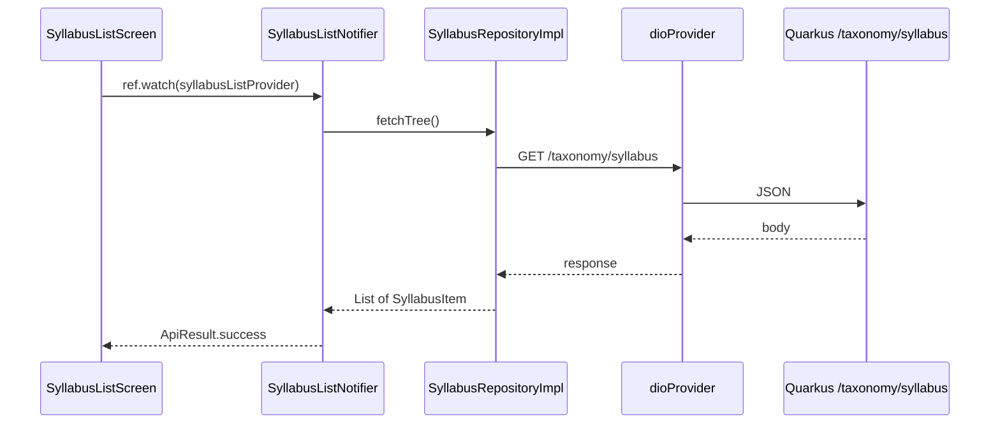

This guide walks through a **complete example**: the **syllabus** feature loads a syllabus tree from the Quarkus API using Preppy’s existing packages. The same steps apply to any CRUD screen.

**Reference code** (implemented in the repo):

`apps/packages/features/syllabus/lib/src/`

For layer concepts and when to use `core_*` vs a feature package, see [Clean architecture & CRUD](/guides/clean-architecture-crud/).

## What you are building

| Piece | Package / path |
|-------|----------------|
| Entity `SyllabusItem` | [`core_models`](/packages/core-models/) — already defined |
| HTTP client | [`core_network`](/packages/core-network/) — `dioProvider`, auth header from shell |
| UI shell | [`shared_ui`](/packages/shared-ui/) — `PreppyScaffold` |
| State | `flutter_riverpod` — `Notifier` + `ApiResult` |
| Feature code | `apps/packages/features/syllabus/` |

**Backend endpoint (read):** `GET /taxonomy/syllabus` — see `TaxonomyResource` in the Quarkus app. Create/update/delete paths in the repository are ready for when the API adds them.



## Folder layout

After following this guide, the syllabus feature looks like this:

```text
apps/packages/features/syllabus/lib/
  feature_syllabus.dart
  src/
    domain/repositories/syllabus_repository.dart
    data/
      mappers/syllabus_mapper.dart
      repositories/syllabus_repository_impl.dart
    application/syllabus_list_notifier.dart
    presentation/syllabus_list_screen.dart
    feature_syllabus_routes.dart
```

## Step 1 — Dependencies

In `apps/packages/features/syllabus/pubspec.yaml`:

```yaml
dependencies:
  core_models:
    path: ../../core/models
  core_network:
    path: ../../core/network
  shared_ui:
    path: ../../shared_ui
  flutter_riverpod: ^3.3.1
  go_router: ^14.6.1
```

| Package | Why |
|---------|-----|
| `core_models` | Shared `SyllabusItem` + `ApiResult` |
| `core_network` | `dioProvider` (base URL + auth token from shell bootstrap) |
| `shared_ui` | Consistent scaffold and theme |
| `flutter_riverpod` | Notifiers and providers |
| `go_router` | Feature routes exported to the shell |

Run `melos bootstrap` from the repo root after editing `pubspec.yaml`.

## Step 2 — Entity (no JSON here)

`SyllabusItem` lives in `core_models` as a **pure** class (no `fromJson` in that package):

```dart
// apps/packages/core/models/lib/entity/syllabus_item.dart
class SyllabusItem {
  const SyllabusItem({
    required this.id,
    required this.code,
    required this.title,
    this.parentId,
    this.children = const [],
  });
  final String id;
  final String? parentId;
  final String code;
  final String title;
  final List<SyllabusItem> children;
}
```

## Step 3 — Domain: repository port

`lib/src/domain/repositories/syllabus_repository.dart` — abstract API your UI will use:

```dart
import 'package:core_models/core_models.dart';

abstract interface class SyllabusRepository {
  Future<List<SyllabusItem>> fetchTree();
  Future<SyllabusItem> fetchById(String id);
  Future<SyllabusItem> create(SyllabusItem draft);
  Future<SyllabusItem> update(SyllabusItem item);
  Future<void> delete(String id);
}
```

## Step 4 — Data: mapper + repository

**Mapper** — `lib/src/data/mappers/syllabus_mapper.dart` converts JSON from Quarkus (`id` / `parentId` as UUID strings):

```dart
mixin SyllabusMapper {
  SyllabusItem syllabusItemFromJson(Map<String, dynamic> json) { /* … */ }
  Map<String, dynamic> syllabusItemToJson(SyllabusItem item) { /* … */ }
}
```

**Implementation** — `lib/src/data/repositories/syllabus_repository_impl.dart`:

- `with SyllabusMapper implements SyllabusRepository`
- Inject `Dio` from `ref.watch(dioProvider)`
- **Read** uses `GET /taxonomy/syllabus` (not `/syllabus` alone)
- Register `syllabusRepositoryProvider`

```dart
final syllabusRepositoryProvider = Provider<SyllabusRepository>((ref) {
  return SyllabusRepositoryImpl(ref.watch(dioProvider));
});
```

`dioProvider` already attaches the Firebase ID token via shell overrides — you do not pass tokens manually in the feature.

## Step 5 — Application: notifier + `ApiResult`

`lib/src/application/syllabus_list_notifier.dart`:

1. `NotifierProvider<SyllabusListNotifier, ApiResult<List<SyllabusItem>>>`
2. On build, schedule `_load()` and return `ApiResult.idle()`
3. Set `ApiResult.loading` → call `repository.fetchTree()` → `success` or `error`

The UI never calls Dio; it only watches `syllabusListProvider`.

## Step 6 — Presentation: list screen

`lib/src/presentation/syllabus_list_screen.dart` — `ConsumerWidget`:

```dart
final state = ref.watch(syllabusListProvider);

return PreppyScaffold(
  title: 'Syllabus',
  body: state.when(
    idle: () => /* placeholder */,
    loading: (_) => const CircularProgressIndicator(),
    success: (items) => ListView.builder(/* … */),
    error: (msg, _, __) => Text(msg),
  ),
);
```

Use `ref.read(syllabusListProvider.notifier).refresh()` for pull-to-refresh or an app bar action.

## Step 7 — Routes and shell

**Feature routes** — `feature_syllabus_routes.dart` points `/syllabus` at `SyllabusListScreen`.

**Shell** — `apps/preppy_app/lib/bootstrap/router.dart` already imports `feature_syllabus.dart` and spreads `...featureSyllabusRoutes`. No shell change needed if the feature is in `preppy_app/pubspec.yaml`.

## Step 8 — Run and verify

1. Start backend: `cd backend && ./mvnw quarkus:dev`
2. Run app: `melos run run:dev` (or `flutter run` from `apps/preppy_app` with env JSON)
3. Sign in, open **Syllabus** (`/syllabus`)
4. You should see loading → empty list or tree items (backend `TaxonomyService` may return empty until implemented)

If you see a network error, check `BASE_URL` in your flavor config points at the Quarkus host (e.g. `http://localhost:8080`).

## Extending to full CRUD

| Operation | Repository method | HTTP (when API exists) |
|-----------|-------------------|-------------------------|
| Read list | `fetchTree()` | `GET /taxonomy/syllabus` |
| Read one | `fetchById(id)` | `GET /taxonomy/syllabus/{id}` |
| Create | `create(draft)` | `POST /taxonomy/syllabus` |
| Update | `update(item)` | `PUT /taxonomy/syllabus/{id}` |
| Delete | `delete(id)` | `DELETE /taxonomy/syllabus/{id}` |

Wire create/edit screens under `presentation/`, call the repository from the notifier (or a dedicated `SyllabusFormNotifier`), then `refresh()` the list.

## Packages cheat sheet

```text
┌──────────────────────────────────────────────────────────────┐
│ SyllabusListScreen          ← shared_ui, flutter_riverpod    │
├──────────────────────────────────────────────────────────────┤
│ SyllabusListNotifier        ← core_models (ApiResult)        │
├──────────────────────────────────────────────────────────────┤
│ SyllabusRepositoryImpl      ← core_network (dioProvider)     │
│ SyllabusMapper              ← maps JSON → SyllabusItem       │
├──────────────────────────────────────────────────────────────┤
│ SyllabusRepository (port)   ← domain interface               │
├──────────────────────────────────────────────────────────────┤
│ SyllabusItem                ← core_models entity             │
└──────────────────────────────────────────────────────────────┘
```

**Cross-cutting auth** (sign-in, token, profile) stays in [`core_auth`](/packages/core-auth/) — the syllabus feature only consumes `dioProvider`, which already sends the token.

## See also

- [Clean architecture & CRUD](/guides/clean-architecture-crud/) — layer map, checklists, anti-patterns
- [core_models](/packages/core-models/) · [core_network](/packages/core-network/) · [Bootstrap](/app/bootstrap/)
- Live source: `apps/packages/features/syllabus/`
