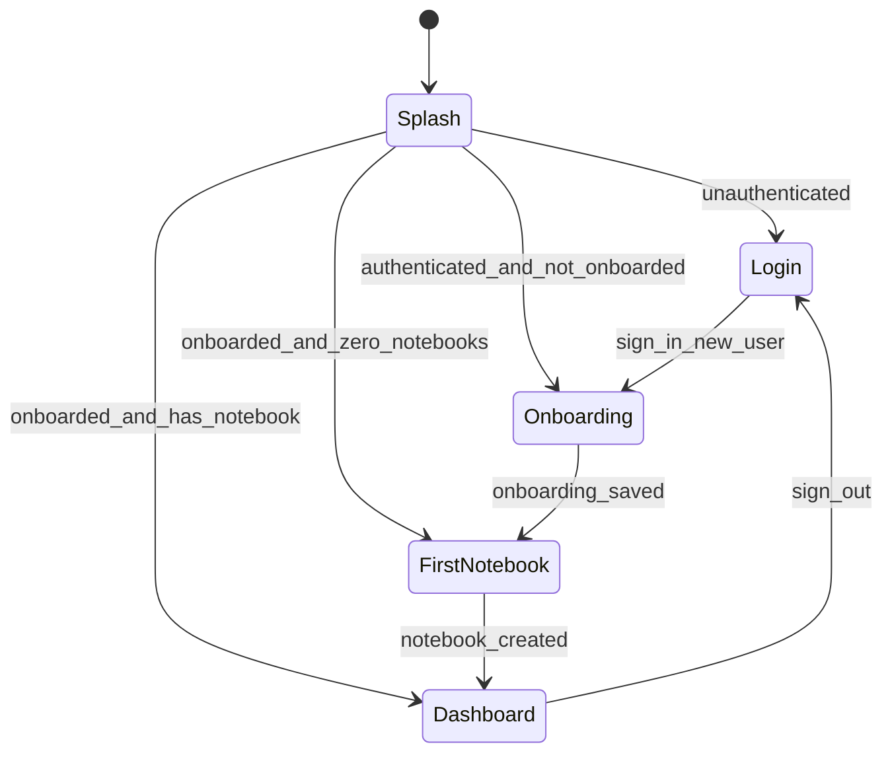
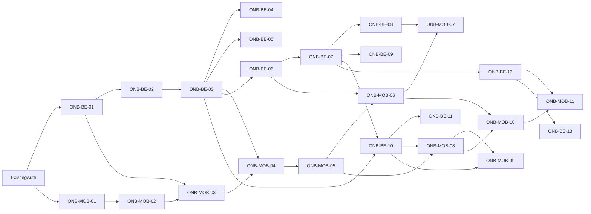

# Onboarding Execution Design

## Purpose

This spec elaborates the onboarding backlog in `ISSUES.md` into concrete backend, Flutter, schema, and verification contracts for milestones MS-01 through MS-04. It is the implementation source of truth for the first Preppy execution slice after the existing Firebase-authenticated shell.

## Scope

Included:

- MS-01: authenticated onboarding and student profile persistence.
- MS-02: first notebook setup and notebook read APIs.
- MS-03: onboarding-aware empty dashboard.
- MS-04: upload readiness contracts and UI state names, without implementing the full ingestion pipeline.

Out of scope:

- Web onboarding.
- Full material upload bytes, extraction, OCR, chunking, embeddings, and ingestion jobs.
- AI generation, PYQ mapping, SRS implementation, and notification delivery.
- Account deletion and retention policy implementation.

## 0. Cross-Cutting Contracts

### Roadmap Trace

| Milestone | Roadmap refs | Primary issues |
| --- | --- | --- |
| MS-01 | M0.1, M1.1, M7.2 | ONB-MOB-01..04, ONB-BE-01..05 |
| MS-02 | M0.2, M1.3 | ONB-MOB-05..07, ONB-BE-06..09 |
| MS-03 | M1.4, M7.1 | ONB-MOB-08..09, ONB-BE-10..11 |
| MS-04 | M0.3, M2.1 | ONB-MOB-10..11, ONB-BE-12..13 |

### API Surface

All endpoints are authenticated through the existing Firebase-backed Quarkus security identity. Clients never send a user ID. Backend services derive the internal `users.id` from the current Firebase token.

| Capability | Method and path | Response envelope |
| --- | --- | --- |
| Current profile and onboarding status | `GET /v1/users/me` | `ApiResponse<ProfileResponse>` |
| Upsert onboarding profile | `PUT /v1/users/me/onboarding` | `ApiResponse<OnboardingProfileResponse>` |
| Create notebook | `POST /v1/notebooks` | `ApiResponse<NotebookResponse>` |
| List current user's notebooks | `GET /v1/notebooks` | `ApiResponse<List<NotebookResponse>>` |
| Read notebook detail | `GET /v1/notebooks/{notebookId}` | `ApiResponse<NotebookResponse>` |
| List notebook materials | `GET /v1/notebooks/{notebookId}/materials` | `ApiResponse<List<NotebookMaterialResponse>>` |
| Dashboard summary | `GET /dashboard/summary` | `ApiResponse<DashboardSummaryResponse>` |

### Shared Enums

Enum values are lowercase JSON strings in REST responses and Dart models.

| Enum | Values |
| --- | --- |
| `StudyLevel` | `school`, `undergraduate`, `postgraduate`, `competitive_exam`, `professional` |
| `GoalType` | `subject`, `course`, `competitive_exam`, `professional_cert` |
| `LearningMethod` | `reading`, `visual`, `mcq`, `flashcards`, `videos`, `writing` |
| `NotebookStatus` | `active`, `archived` |
| `DashboardNextAction` | `complete_onboarding`, `create_notebook`, `upload_material`, `start_practice`, `none` |
| `MaterialType` | `syllabus`, `textbook`, `notes`, `image`, `pyq`, `other` |
| `MaterialSourceRole` | `syllabus`, `primary_source`, `reference`, `notes`, `pyq` |
| `MaterialStatus` | `none`, `pending`, `processing`, `ready`, `failed` |

### Backend Schema

Migration: `backend/src/main/resources/db/migration/V2__onboarding_notebooks.sql`

```sql
ALTER TABLE users
    ADD COLUMN onboarding_completed_at TIMESTAMPTZ;

CREATE TABLE student_profiles (
    user_id UUID PRIMARY KEY REFERENCES users (id) ON DELETE CASCADE,
    learning_target TEXT NOT NULL CHECK (length(trim(learning_target)) BETWEEN 1 AND 200),
    study_level TEXT NOT NULL CHECK (study_level IN ('school', 'undergraduate', 'postgraduate', 'competitive_exam', 'professional')),
    goal_type TEXT NOT NULL CHECK (goal_type IN ('subject', 'course', 'competitive_exam', 'professional_cert')),
    target_date DATE NOT NULL,
    language_preference TEXT,
    created_at TIMESTAMPTZ NOT NULL DEFAULT now(),
    updated_at TIMESTAMPTZ NOT NULL DEFAULT now()
);

CREATE TABLE learning_capability_profiles (
    user_id UUID PRIMARY KEY REFERENCES users (id) ON DELETE CASCADE,
    daily_minutes INT NOT NULL CHECK (daily_minutes BETWEEN 5 AND 480),
    preferred_learning_methods TEXT[] NOT NULL CHECK (array_length(preferred_learning_methods, 1) >= 1),
    baseline_confidence INT CHECK (baseline_confidence BETWEEN 1 AND 5),
    created_at TIMESTAMPTZ NOT NULL DEFAULT now(),
    updated_at TIMESTAMPTZ NOT NULL DEFAULT now()
);

CREATE TABLE notification_preferences (
    user_id UUID PRIMARY KEY REFERENCES users (id) ON DELETE CASCADE,
    notifications_enabled BOOLEAN NOT NULL DEFAULT false,
    quiet_hours_start TIME,
    quiet_hours_end TIME,
    created_at TIMESTAMPTZ NOT NULL DEFAULT now(),
    updated_at TIMESTAMPTZ NOT NULL DEFAULT now(),
    CONSTRAINT quiet_hours_pair CHECK (
        (quiet_hours_start IS NULL AND quiet_hours_end IS NULL)
        OR (quiet_hours_start IS NOT NULL AND quiet_hours_end IS NOT NULL)
    ),
    CONSTRAINT quiet_hours_distinct CHECK (
        quiet_hours_start IS NULL OR quiet_hours_start <> quiet_hours_end
    )
);

CREATE TABLE notebooks (
    id UUID PRIMARY KEY DEFAULT gen_random_uuid(),
    user_id UUID NOT NULL REFERENCES users (id) ON DELETE CASCADE,
    name TEXT NOT NULL CHECK (length(trim(name)) BETWEEN 1 AND 120),
    goal_type TEXT NOT NULL CHECK (goal_type IN ('subject', 'course', 'competitive_exam', 'professional_cert')),
    subject_label TEXT NOT NULL CHECK (length(trim(subject_label)) BETWEEN 1 AND 160),
    target_date DATE NOT NULL,
    board TEXT,
    semester TEXT,
    exam_track TEXT,
    status TEXT NOT NULL DEFAULT 'active' CHECK (status IN ('active', 'archived')),
    created_at TIMESTAMPTZ NOT NULL DEFAULT now(),
    updated_at TIMESTAMPTZ NOT NULL DEFAULT now()
);

CREATE UNIQUE INDEX ux_notebooks_active_name
    ON notebooks (user_id, lower(name))
    WHERE status = 'active';

CREATE INDEX idx_notebooks_user_status_created
    ON notebooks (user_id, status, created_at DESC);

CREATE TABLE notebook_materials (
    id UUID PRIMARY KEY DEFAULT gen_random_uuid(),
    user_id UUID NOT NULL REFERENCES users (id) ON DELETE CASCADE,
    notebook_id UUID NOT NULL REFERENCES notebooks (id) ON DELETE CASCADE,
    material_type TEXT NOT NULL CHECK (material_type IN ('syllabus', 'textbook', 'notes', 'image', 'pyq', 'other')),
    source_role TEXT NOT NULL CHECK (source_role IN ('syllabus', 'primary_source', 'reference', 'notes', 'pyq')),
    filename TEXT NOT NULL,
    status TEXT NOT NULL DEFAULT 'pending' CHECK (status IN ('none', 'pending', 'processing', 'ready', 'failed')),
    document_id UUID,
    job_id UUID,
    created_at TIMESTAMPTZ NOT NULL DEFAULT now(),
    updated_at TIMESTAMPTZ NOT NULL DEFAULT now()
);

CREATE INDEX idx_notebook_materials_notebook
    ON notebook_materials (user_id, notebook_id, created_at DESC);
```

`users.onboarding_completed_at` is the source of truth for onboarding status. The service sets it after the profile, capability profile, and notification preference upsert succeeds in one transaction. Clearing onboarding is not part of this slice.

### REST DTOs

```java
public record OnboardingUpsertRequest(
        @NotBlank @Size(max = 200) String learningTarget,
        @NotNull StudyLevel studyLevel,
        @NotNull GoalType goalType,
        @NotNull @FutureOrPresent LocalDate targetDate,
        @Min(5) @Max(480) int dailyMinutes,
        @NotEmpty List<LearningMethod> preferredLearningMethods,
        boolean notificationsEnabled,
        LocalTime quietHoursStart,
        LocalTime quietHoursEnd) {}

public record OnboardingProfileResponse(
        boolean onboardingCompleted,
        Instant onboardingCompletedAt,
        String learningTarget,
        StudyLevel studyLevel,
        GoalType goalType,
        LocalDate targetDate,
        int dailyMinutes,
        List<LearningMethod> preferredLearningMethods,
        boolean notificationsEnabled,
        LocalTime quietHoursStart,
        LocalTime quietHoursEnd) {}

public record NotebookCreateRequest(
        @NotBlank @Size(max = 120) String name,
        @NotNull GoalType goalType,
        @NotBlank @Size(max = 160) String subjectLabel,
        @NotNull @FutureOrPresent LocalDate targetDate,
        String board,
        String semester,
        String examTrack) {}

public record NotebookResponse(
        UUID id,
        String name,
        GoalType goalType,
        String subjectLabel,
        LocalDate targetDate,
        String board,
        String semester,
        String examTrack,
        NotebookStatus status,
        Instant createdAt,
        Instant updatedAt) {}

public record DashboardSummaryResponse(
        String greeting,
        boolean onboardingCompleted,
        int notebookCount,
        DashboardNextAction nextAction,
        DashboardMetricsResponse metrics,
        DashboardPlanTodayResponse planToday) {}

public record DashboardMetricsResponse(
        int streakDays,
        int cardsDueToday,
        int coveragePercent,
        int pyqCoveragePercent) {}

public record NotebookMaterialResponse(
        UUID id,
        UUID notebookId,
        MaterialType materialType,
        MaterialSourceRole sourceRole,
        String filename,
        MaterialStatus status,
        UUID documentId,
        UUID jobId,
        Instant createdAt,
        Instant updatedAt) {}
```

`ProfileResponse` keeps its existing identity fields and adds:

```java
boolean onboardingCompleted;
Instant onboardingCompletedAt;
OnboardingProfileResponse onboardingProfile;
```

The existing `metadata` map remains for backward compatibility during this slice but mobile onboarding must not depend on it.

### Validation And Errors

The backend uses Bean Validation where possible and explicit service validation for rules that span fields or require database checks. Responses use the existing `ErrorResponse` shape.

| Case | HTTP | `message` | `errors` entry |
| --- | --- | --- | --- |
| Missing or blank learning target | 400 | `Request validation failed` | `learningTarget: must not be blank` |
| Target date in past | 400 | `Request validation failed` | `targetDate: must be a date in the present or in the future` |
| Daily minutes out of range | 400 | `Request validation failed` | `dailyMinutes: must be greater than or equal to 5` or max equivalent |
| Empty learning methods | 400 | `Request validation failed` | `preferredLearningMethods: must not be empty` |
| Quiet hour start equals end | 400 | `Invalid onboarding preference` | `quietHoursStart: quiet hours start and end must be different` |
| Duplicate active notebook name | 409 | `Notebook name already exists` | `name: active notebook names must be unique per user` |
| Foreign notebook read | 404 | `Notebook not found` | omitted |
| Unknown enum value | 400 | `Request validation failed` | Jackson enum path or common mapper output |

Mobile use cases map 400 validation responses to `ValidationError`, 401 to `UnauthorizedError`, 404 to `NotFoundError`, 409 duplicate notebook name to `ValidationError({'name': ...})`, network failures to `NetworkError`, and all else to `UnknownError`.

### Flutter Route Gate

Gate state is computed from backend-backed profile and notebook data. Local route state can cache during a session but cannot be the source of truth after restart.



Recommended files:

| Responsibility | File |
| --- | --- |
| Session gate coordinator | `apps/preppy_app/lib/bootstrap/session_gate_provider.dart` |
| Router redirect integration | `apps/preppy_app/lib/bootstrap/router.dart` |
| Onboarding feature export | `apps/packages/features/onboarding/lib/feature_onboarding.dart` |
| Onboarding routes | `apps/packages/features/onboarding/lib/src/feature_onboarding_routes.dart` |
| Notebook feature export | `apps/packages/features/notebook/lib/feature_notebook.dart` |
| Notebook routes | `apps/packages/features/notebook/lib/src/feature_notebook_routes.dart` |

The router may watch the auth provider and read a single gate provider. Full-screen widgets continue to watch exactly one screen provider.

## 1. MS-01: Onboarding And Student Profile

### ONB-MOB-01: Add onboarding route gate after auth

User story: as a newly authenticated learner, I am sent to onboarding before seeing dashboard content.

Implementation anchors:

- Modify `apps/preppy_app/lib/bootstrap/router.dart`.
- Create `apps/preppy_app/lib/bootstrap/session_gate_provider.dart`.
- Import `feature_onboarding` in `apps/preppy_app/pubspec.yaml` and `router.dart`.

Acceptance detail:

- `AuthAuthenticated` plus `onboardingCompleted == false` redirects `/dashboard`, `/practice`, `/pyq`, `/syllabus`, and `/ingestion` to `/onboarding`.
- `/login` and `/splash` remain accessible according to current auth logic.
- Sign-out invalidates gate state and returns to `/login`.

Verification:

- Flutter integration or router unit test: unauthenticated -> `/login`, new authenticated -> `/onboarding`, completed user with notebook -> `/dashboard`.

### ONB-MOB-02: Build onboarding screen state and ViewModel

User story: onboarding form state is typed, testable, and independent from raw `AsyncValue`.

Implementation anchors:

- Create `apps/packages/features/onboarding/lib/src/application/state/onboarding_screen_state.dart`.
- Create `apps/packages/features/onboarding/lib/src/application/view_models/onboarding_view_model.dart`.
- Create `apps/packages/features/onboarding/lib/src/application/providers/onboarding_providers.dart`.

State shape:

```dart
class OnboardingDraft {
  const OnboardingDraft({
    required this.learningTarget,
    required this.studyLevel,
    required this.goalType,
    required this.targetDate,
    required this.dailyMinutes,
    required this.preferredLearningMethods,
    required this.notificationsEnabled,
    this.quietHoursStart,
    this.quietHoursEnd,
  });
}
```

`OnboardingScreenState extends ScreenState<OnboardingDraft>` and adds `fieldErrors` for local validation messages. The ViewModel extends `BaseViewModel<OnboardingDraft, OnboardingScreenState>` and uses `loadData` or `refreshData` for profile load.

Verification:

- `flutter test apps/packages/features/onboarding/test/application/onboarding_view_model_test.dart`
- Cases: initial draft, invalid local validation, saving phase, success, mapped validation error.

### ONB-MOB-03: Implement learner profile form

User story: the learner can enter the profile values needed for future plan generation.

Fields:

- Learning target text.
- Study level select.
- Goal type select.
- Target date picker.
- Daily minutes numeric input or bounded selector.
- Preferred learning methods multi-select.
- Notification opt-in.
- Quiet hours start and end, only enabled when notifications are enabled.

Implementation anchors:

- Create `apps/packages/features/onboarding/lib/src/presentation/onboarding_screen.dart`.
- Create small form widgets under `apps/packages/features/onboarding/lib/src/presentation/widgets/`.
- Create `apps/packages/features/onboarding/lib/src/data/repositories/api_onboarding_repository.dart`.
- Create DTO mapper under `apps/packages/features/onboarding/lib/src/data/mappers/onboarding_mapper.dart`.

Acceptance detail:

- Required fields block submission before repository call.
- Submitted JSON matches `OnboardingUpsertRequest`.
- Error display uses `resolveErrorMessage` for typed `AppError` and field-specific messages for `ValidationError`.

Verification:

- `flutter test apps/packages/features/onboarding/test/presentation/onboarding_screen_test.dart`
- Fill valid form and assert repository receives the expected request object.

### ONB-MOB-04: Persist onboarding completion state

User story: after saving onboarding, restart and refresh use backend state to skip onboarding.

Implementation anchors:

- `OnboardingRepository.upsertOnboarding`.
- `OnboardingViewModel.save`.
- Invalidate or refresh `sessionGateProvider` after successful save.

Acceptance detail:

- Success sets `users.onboarding_completed_at` through backend.
- Failed save leaves entered values editable and displays typed error.
- App restart calls `GET /v1/users/me` and routes by backend status.

Verification:

- Manual smoke or integration test: sign in, save onboarding, kill app, relaunch, dashboard or first-notebook route opens based on notebook count.

### ONB-BE-01: Add onboarding profile DTOs

User story: backend and clients share typed request/response schemas for onboarding.

Implementation anchors:

- Create `backend/src/main/java/com/preppy/user/dto/OnboardingUpsertRequest.java`.
- Create `backend/src/main/java/com/preppy/user/dto/OnboardingProfileResponse.java`.
- Create enum classes in `backend/src/main/java/com/preppy/user/model/` or a shared `profile` package.
- Extend `backend/src/main/java/com/preppy/auth/dto/ProfileResponse.java`.

Acceptance detail:

- DTOs include every field in the REST DTO section.
- Bean Validation annotations cover single-field constraints.
- OpenAPI shows enum values.

Verification:

- `cd backend && ./mvnw test -Dtest=OnboardingDtoTest`

### ONB-BE-02: Add profile persistence migration

User story: learner profile data is durable, relational, and user-scoped.

Implementation anchors:

- Add `backend/src/main/resources/db/migration/V2__onboarding_notebooks.sql`.
- Include `student_profiles`, `learning_capability_profiles`, `notification_preferences`, `notebooks`, and `notebook_materials`.

Acceptance detail:

- Migration succeeds from a clean database.
- Required fields use `NOT NULL` and `CHECK`.
- Every table references `users(id)` with `ON DELETE CASCADE`.

Verification:

- `cd backend && ./mvnw test`
- Migration-focused integration test if backend already has database test infrastructure.

### ONB-BE-03: Implement authenticated onboarding upsert/read API

User story: mobile can save onboarding and read completion state using authenticated user identity only.

Implementation anchors:

- Extend `backend/src/main/java/com/preppy/user/UserResource.java` with `PUT /me/onboarding`.
- Extend `backend/src/main/java/com/preppy/user/UserService.java`.
- Add repository methods to upsert profile, capability, notification preferences, and completion timestamp.

Acceptance detail:

- Upsert is idempotent.
- The transaction writes all three profile tables or none.
- `GET /v1/users/me` returns `onboardingCompleted` and profile data after save.

Verification:

- `cd backend && ./mvnw test -Dtest=OnboardingResourceIT`

### ONB-BE-04: Return typed onboarding validation errors

User story: invalid onboarding input returns structured, user-safe errors.

Implementation anchors:

- Bean Validation on `OnboardingUpsertRequest`.
- Service validation for quiet hours pair and distinct values.
- Use `AppException.badRequest` for cross-field preference rules.

Acceptance detail:

- No stack traces or raw SQL errors reach the client.
- Validation response paths match the validation matrix.
- Unsupported enum values return 400.

Verification:

- `cd backend && ./mvnw test -Dtest=OnboardingResourceIT#invalidOnboardingInputReturnsValidationErrors`

### ONB-BE-05: Document onboarding API in OpenAPI

User story: API consumers can inspect onboarding contracts in Swagger/OpenAPI.

Implementation anchors:

- Annotate resource methods with SmallRye OpenAPI metadata if existing project style requires it.
- Ensure DTO records and enums are public and discoverable.

Acceptance detail:

- `/q/openapi` includes `PUT /v1/users/me/onboarding`.
- Auth requirement is visible.
- Request and response schemas include enum values and validation constraints where supported.

Verification:

- `cd backend && ./mvnw test -Dtest=OpenApiContractTest`
- Or manual dev-mode inspection at `/q/openapi`.

## 2. MS-02: First Notebook Setup

### ONB-MOB-05: Add first-notebook route after onboarding

User story: an onboarded learner with no notebooks is guided to create the first workspace.

Implementation anchors:

- Add `apps/packages/features/notebook/`.
- Add `/onboarding/first-notebook` route.
- Extend `session_gate_provider.dart` to include notebook count.

Acceptance detail:

- Onboarded zero-notebook users redirect to `/onboarding/first-notebook`.
- Users with one or more active notebooks continue to `/dashboard`.
- Archived notebooks do not satisfy the first-notebook gate.

Verification:

- Router test with fixtures for no profile, profile with zero active notebooks, and profile with one active notebook.

### ONB-MOB-06: Build notebook creation form

User story: the learner can create a notebook for a subject, course, or exam.

Fields:

- Notebook name.
- Goal type.
- Subject, course, or exam label as `subjectLabel`.
- Target completion date.
- Optional board.
- Optional semester.
- Optional exam track.

Implementation anchors:

- `apps/packages/features/notebook/lib/src/presentation/first_notebook_screen.dart`.
- `apps/packages/features/notebook/lib/src/application/view_models/notebook_creation_view_model.dart`.
- `apps/packages/features/notebook/lib/src/data/repositories/api_notebook_repository.dart`.

Acceptance detail:

- Blank name and label are blocked locally.
- Save button is disabled while saving.
- Successful creation invalidates the session gate and navigates to `/dashboard`.

Verification:

- `flutter test apps/packages/features/notebook/test/presentation/first_notebook_screen_test.dart`

### ONB-MOB-07: Show notebook creation error states

User story: validation, auth, and network failures are visible without losing form input.

Implementation anchors:

- `NotebookCreationScreenState extends ScreenState<NotebookDraft>`.
- `NotebookCreationViewModel.save`.

Acceptance detail:

- Duplicate active name maps to name field error.
- Invalid date maps to target date field error.
- Network failure renders a shared error banner and keeps input.

Verification:

- Widget tests inject `ValidationError`, `UnauthorizedError`, and `NetworkError` fixtures.

### ONB-BE-06: Add notebook persistence schema

User story: notebooks are durable user-owned workspaces.

Implementation anchors:

- `notebooks` table and indexes in `V2__onboarding_notebooks.sql`.

Acceptance detail:

- Required fields constrained.
- Active notebook names are unique per user, case-insensitive.
- Status defaults to `active`.

Verification:

- Migration or repository test creates two users with the same notebook name successfully, then rejects duplicate active name for one user.

### ONB-BE-07: Implement notebook create/list/detail APIs

User story: mobile can create and fetch the current user's notebooks.

Implementation anchors:

- Create `backend/src/main/java/com/preppy/notebook/NotebookResource.java`.
- Create `NotebookService.java`, `NotebookRepository.java`, DTOs, and enums.

Acceptance detail:

- `POST /v1/notebooks` derives owner from current user.
- `GET /v1/notebooks` returns only current user's notebooks, active first, newest first.
- `GET /v1/notebooks/{notebookId}` returns 404 for missing or foreign notebook.

Verification:

- `cd backend && ./mvnw test -Dtest=NotebookResourceIT`

### ONB-BE-08: Add notebook validation rules

User story: invalid notebook requests fail predictably without partial writes.

Validation rules:

- Name cannot be blank and max length is 120.
- `subjectLabel` cannot be blank and max length is 160.
- Target date cannot be in the past.
- `goalType` must be a supported enum value.
- Duplicate active notebook names fail with 409 and a field error.

Verification:

- `cd backend && ./mvnw test -Dtest=NotebookResourceIT#invalidNotebookRequestsReturnValidationErrors`

### ONB-BE-09: Add notebook OpenAPI docs

User story: mobile and QA can inspect notebook create/list/detail schemas.

Acceptance detail:

- `/q/openapi` includes create, list, and detail paths.
- Auth is documented.
- Validation and conflict responses are documented or covered in contract tests.

Verification:

- `cd backend && ./mvnw test -Dtest=OpenApiContractTest`

## 3. MS-03: Onboarding-Aware Empty Dashboard

### Dashboard Summary Contract

For an authenticated new user with no onboarding:

```json
{
  "data": {
    "greeting": "Welcome to Preppy",
    "onboardingCompleted": false,
    "notebookCount": 0,
    "nextAction": "complete_onboarding",
    "metrics": {
      "streakDays": 0,
      "cardsDueToday": 0,
      "coveragePercent": 0,
      "pyqCoveragePercent": 0
    },
    "planToday": null
  }
}
```

For an onboarded user with no notebooks, `nextAction` is `create_notebook`. For a user with a notebook and no material, `nextAction` is `upload_material`. The current static demo values `7`, `24`, and `68` are removed for empty accounts.

### ONB-MOB-08: Replace static new-user dashboard with empty state

User story: a new user sees honest next steps, not fake metrics.

Implementation anchors:

- Extend `apps/packages/features/dashboard/lib/src/domain/entities/dashboard_summary.dart`.
- Update `apps/packages/features/dashboard/lib/src/data/mappers/dashboard_summary_mapper.dart`.
- Update `apps/packages/features/dashboard/lib/src/presentation/dashboard_screen.dart`.

Acceptance detail:

- Empty accounts render a create-notebook or complete-onboarding CTA based on `nextAction`.
- No fake coverage, due-card, streak, or PYQ values appear when metrics are zero.

Verification:

- `flutter test apps/packages/features/dashboard/test/presentation/dashboard_screen_test.dart`

### ONB-MOB-09: Add dashboard CTA wiring

User story: dashboard actions route to the correct next setup step.

CTA mapping:

| `nextAction` | CTA route |
| --- | --- |
| `complete_onboarding` | `/onboarding` |
| `create_notebook` | `/onboarding/first-notebook` |
| `upload_material` | `/notebooks/{notebookId}/materials` or existing ingestion route with notebook context |
| `start_practice` | existing practice route |
| `none` | no setup CTA |

Verification:

- Widget test with dashboard summary fixtures for no profile, no notebook, has notebook with no material, and no next action.

### ONB-BE-10: Extend dashboard summary with onboarding state

User story: dashboard summary reflects real profile and notebook state.

Implementation anchors:

- Replace static logic in `backend/src/main/java/com/preppy/dashboard/DashboardResource.java`.
- Add `DashboardService` if the resource currently builds DTOs directly.
- Read `users.onboarding_completed_at` and active notebook count from Postgres.

Acceptance detail:

- New account returns `complete_onboarding`.
- Onboarded zero-notebook account returns `create_notebook`.
- Account with active notebook but no materials returns `upload_material`.
- Account with material-ready state can later return `start_practice` or `none`.

Verification:

- `cd backend && ./mvnw test -Dtest=DashboardResourceIT`

### ONB-BE-11: Remove static dashboard assumptions for empty accounts

User story: dashboard metrics never pretend work happened for empty accounts.

Acceptance detail:

- Empty users receive all metric values as `0` and `planToday: null`.
- The response includes explicit next-action metadata.
- Existing static values are not returned from backend or hard-coded in mobile fixtures except as non-empty-account test fixtures.

Verification:

- `cd backend && ./mvnw test -Dtest=DashboardResourceIT#emptyAccountHasZeroMetrics`

## 4. MS-04: Upload And Study-Loop Readiness

MS-04 defines the handoff into ingestion without implementing extraction. The goal is to avoid building another loose document upload path that is not scoped to a notebook.

### ONB-MOB-10: Add notebook material entry point

User story: after creating a notebook, the learner sees the next step to add syllabus or source material.

Implementation anchors:

- Notebook home or dashboard CTA target.
- `apps/packages/features/notebook/lib/src/presentation/notebook_material_entry_card.dart`.

Acceptance detail:

- Users with an active notebook see an upload or source-material CTA.
- Unsupported upload behavior is labelled as pending if full ingestion is not implemented.
- CTA carries notebook ID in route state or path.

Verification:

- Manual smoke or widget test: create notebook summary fixture and assert material CTA appears.

### ONB-MOB-11: Define upload-ready UI states

User story: UI state names align with backend material/job terminology before ingestion lands.

UI states:

- `noMaterial`
- `uploadPending`
- `uploadProcessing`
- `uploadFailed`
- `uploadReady`

Mapping:

| Backend `MaterialStatus` | UI state |
| --- | --- |
| `none` | `noMaterial` |
| `pending` | `uploadPending` |
| `processing` | `uploadProcessing` |
| `failed` | `uploadFailed` |
| `ready` | `uploadReady` |

Verification:

- `flutter test apps/packages/features/notebook/test/presentation/notebook_material_state_test.dart`

### ONB-BE-12: Define notebook material metadata contract

User story: backend has a notebook-scoped metadata shape for future upload and ingestion.

Implementation anchors:

- `notebook_materials` table in `V2__onboarding_notebooks.sql`.
- `GET /v1/notebooks/{notebookId}/materials`.
- DTO `NotebookMaterialResponse`.

Acceptance detail:

- Material rows are user-scoped and notebook-scoped.
- Foreign notebook material requests return 404.
- Response includes notebook ID, material type, source role, filename, status, document ID, job ID, and timestamps.

Verification:

- `cd backend && ./mvnw test -Dtest=NotebookMaterialContractTest`

### ONB-BE-13: Align ingestion stub with notebook scope

User story: future upload work cannot continue as a loose document API.

Contract requirement:

- Before M2.1 implements full upload, `POST /ingestion/upload` must accept and validate `notebookId`.
- Backend must confirm notebook ownership before creating document, material, or job records.
- If the endpoint remains under `/ingestion`, OpenAPI marks `notebookId` as required. If the endpoint moves to `/v1/notebooks/{notebookId}/materials/upload`, the old endpoint returns a documented compatibility error or is removed before public beta.

Acceptance detail:

- No upload path can create an `ingested_docs` row without a notebook-scoped `notebook_materials` row or equivalent link.

Verification:

- Contract test or API test rejects upload without notebook scope before ingestion implementation begins.

## 5. Issue Dependency Graph



## 6. Per-Issue Crosswalk

| Issue | Spec anchors | Primary files | Verification |
| --- | --- | --- | --- |
| ONB-MOB-01 | Route gate | `router.dart`, `session_gate_provider.dart`, onboarding routes | Router integration test |
| ONB-MOB-02 | Onboarding state | onboarding state, ViewModel, providers | `onboarding_view_model_test.dart` |
| ONB-MOB-03 | Onboarding form | onboarding screen, widgets, repository, mapper | `onboarding_screen_test.dart` |
| ONB-MOB-04 | Save and refresh | repository, ViewModel, gate invalidation | restart smoke |
| ONB-BE-01 | DTOs | user DTOs, profile response, enums | `OnboardingDtoTest` |
| ONB-BE-02 | Migration | `V2__onboarding_notebooks.sql` | `./mvnw test` |
| ONB-BE-03 | Upsert/read API | `UserResource`, `UserService`, repository | `OnboardingResourceIT` |
| ONB-BE-04 | Validation | request annotations, service validation | invalid-input API tests |
| ONB-BE-05 | OpenAPI | resource annotations and DTO visibility | `OpenApiContractTest` or `/q/openapi` |
| ONB-MOB-05 | First notebook gate | notebook routes, session gate | router fixtures |
| ONB-MOB-06 | Notebook form | notebook screen, state, repository | `first_notebook_screen_test.dart` |
| ONB-MOB-07 | Notebook errors | notebook state and save logic | error fixture widget tests |
| ONB-BE-06 | Notebook schema | `notebooks` table and indexes | migration/repository test |
| ONB-BE-07 | Notebook APIs | `NotebookResource`, service, repository | `NotebookResourceIT` |
| ONB-BE-08 | Notebook validation | DTO annotations and conflict handling | invalid-notebook API tests |
| ONB-BE-09 | Notebook OpenAPI | notebook resource and DTO schemas | OpenAPI contract test |
| ONB-MOB-08 | Empty dashboard | dashboard entity, mapper, screen | dashboard widget test |
| ONB-MOB-09 | CTA wiring | dashboard screen actions/routes | dashboard fixture tests |
| ONB-BE-10 | Dashboard summary | `DashboardResource`, service, repository reads | `DashboardResourceIT` |
| ONB-BE-11 | Zero metrics | dashboard service empty-state branch | empty-account API test |
| ONB-MOB-10 | Material entry | notebook material card/screen | material CTA widget test |
| ONB-MOB-11 | Upload states | notebook material state enum and fixtures | material state widget test |
| ONB-BE-12 | Material contract | material table, response DTO, list endpoint | `NotebookMaterialContractTest` |
| ONB-BE-13 | Notebook-scoped ingestion | ingestion upload contract | upload-without-notebook rejection test |

## 7. Self-Review

- Placeholder scan: this spec contains concrete endpoint paths, DTO fields, schema, enum values, and verification commands.
- Internal consistency: `users.onboarding_completed_at` is the route gate source of truth, while profile tables hold plan inputs.
- Scope check: MS-04 is explicitly contract-only and does not include upload extraction.
- Ambiguity check: notebook subject/course/exam label is stored as `subjectLabel` for MVP, with optional context fields for board, semester, and exam track.
